# Computação Visual — as quatro áreas, executadas

**Disciplina:** Computação Gráfica I · **Professor:** Jonh Edson
**Atividade:** demonstrar as diferenças e as principais características das áreas relacionadas à Computação Visual — Síntese de Imagens (Computação Gráfica), Processamento de Imagens, Visão Computacional (Artificial) e Visualização Computacional.

Para cada área foi selecionada uma aplicação, apresentados os seus aspectos principais e **executado código de repositório público**, com explicação dos aspectos específicos daquela área. Todos os números e imagens deste documento vêm da execução real registrada em [`relatorio/log_execucao.txt`](relatorio/log_execucao.txt).

---

## 1. A tese: cada área se define pelo par (o que entra, o que sai)

O material da disciplina (`aula02/intro_computacao_visual.pdf`, slide 66) descreve as quatro áreas como *"áreas de pesquisa com identidade própria e focos distintos, mas que interagem entre si e compartilham técnicas e algoritmos"*. O que dá identidade a cada uma não é a técnica — várias são compartilhadas — e sim **o tipo de dado que entra e o tipo de dado que sai**.

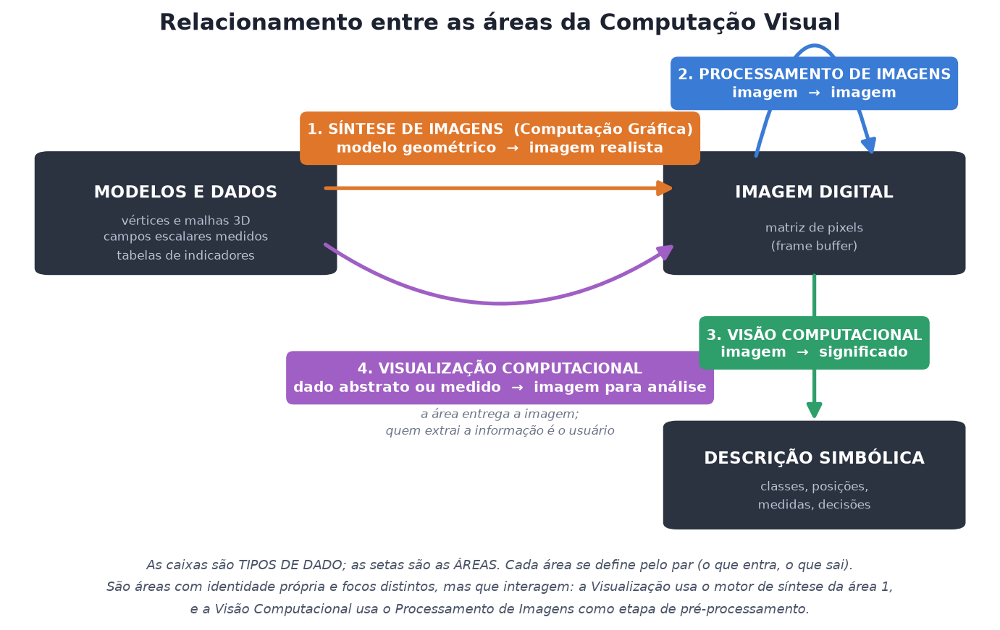

No diagrama, as **caixas são tipos de dado** e as **setas são as áreas**. Essa é a leitura que separa as quatro sem ambiguidade.

| | Área | Entra | Sai | Pergunta que responde |
|---|---|---|---|---|
| 1 | **Síntese de Imagens** (Computação Gráfica) | modelo geométrico + material + luz + câmera | imagem matricial | *Como este objeto se pareceria?* |
| 2 | **Processamento de Imagens** | imagem | imagem | *Como deixar esta imagem melhor / mais útil?* |
| 3 | **Visão Computacional** (Artificial) | imagem | descrição simbólica (dados) | *O que há nesta imagem?* |
| 4 | **Visualização Computacional** | dados medidos ou abstratos | imagem para análise | *O que estes dados estão dizendo?* |

Repare na simetria: a **Síntese** e a **Visão** são operações inversas (`dados → imagem` contra `imagem → dados`); o **Processamento** é a única que permanece no mesmo domínio; e a **Visualização** compartilha o motor de renderização da Síntese, mas troca o objetivo de *realismo* por *legibilidade*.


---

## 2. Como executar

Ambiente usado: **Python 3.12 / Windows 11 / GPU Intel Iris Xe** (o pipeline gráfico roda em contexto OpenGL 3.3 Core *offscreen*, sem abrir janela).

```bash
python -m venv .venv
.venv\Scripts\activate                     # Windows
pip install -r requirements.txt
pip install torch --index-url https://download.pytorch.org/whl/cpu

python executar_tudo.py                    # roda as quatro áreas em sequência
```

Ou individualmente:

```bash
python 01_sintese_imagens/sintese_opengl.py
python 02_processamento_imagens/processamento_opencv.py
python 03_visao_computacional/visao_yolo.py
python 04_visualizacao_computacional/visualizacao_vtk.py
python 00_comparativo/gerar_comparativo.py
```

Tempo total da execução completa: **≈ 22 s**. Os dados de entrada (imagens de teste, pesos do YOLO, tomografia, tabela do Gapminder) vêm todos de repositórios públicos e são baixados/versionados em `assets/`.

> **Nota sobre o OpenCV:** é obrigatório usar a série **4.x**. O OpenCV 5.0 removeu `cv2.HOGDescriptor`, usado na comparação clássico × aprendizado profundo da Área 3. O `requirements.txt` fixa `opencv-python==4.14.0.94`.

---

## 3. Área 1 — Síntese de Imagens (Computação Gráfica)

> *"Técnicas para gerar representações visuais a partir de especificações geométricas e de atributos visuais dos seus componentes. Modelagem e rendering. Objetivo: 'mundo' 3D no computador."*
> — `aula02/intro_computacao_visual.pdf`, slide 15

### Aplicação escolhida

**Pipeline de rasterização OpenGL 3.3 Core**, dirigido pela biblioteca **ModernGL**.

| Item | Valor |
|---|---|
| Repositório público | <https://github.com/moderngl/moderngl> |
| Modelo renderizado | `aula08/objetos/dragao.obj` (material da própria disciplina) |
| Programa | [`01_sintese_imagens/sintese_opengl.py`](01_sintese_imagens/sintese_opengl.py) |

A escolha é deliberada: o material da aula 02 (`bibliotecas_graficas.pdf`) dedica a segunda metade ao **OpenGL moderna (3.3+)** e ao pipeline vértices → montagem de polígonos → rasterização → *fragment shader* → *frame buffer*. O programa percorre exatamente esse caminho, com cada etapa isolada e comentada.

### Aspectos da área evidenciados

1. **Modelagem** — leitura da malha Wavefront `.obj`: só vértices e faces, nenhum pixel.
2. **Poligonização** — a malha já é triangular; as normais por vértice são calculadas como média das normais das faces incidentes.
3. **Transformações geométricas** — as matrizes `Model`, `View` e `Projection` são construídas à mão em coordenadas homogêneas 4×4 (conteúdo das aulas 04, 07 e 08), não importadas de biblioteca.
4. **Rasterização** — a conversão vetorial → matricial acontece na GPU.
5. **Modelo de iluminação** — Phong (ambiente + difusa + especular) escrito em GLSL, com correção gama.
6. **Remoção de superfícies ocultas** — *z-buffer* (`DEPTH_TEST`).
7. **Frame buffer** — leitura do buffer de cor com MSAA 4× e gravação em PNG.

Há ainda um detalhe implementado à parte: um **ajuste de enquadramento** que projeta todos os vértices, mede a caixa envolvente já em NDC e aplica uma escala + translação 2D no espaço de recorte. Como `x_ndc = x_clip / w`, multiplicar `x_clip` por `k` e somar `−k·cx·w` equivale a `(x_ndc − cx)·k`, sem tocar em `z` — o *z-buffer* continua válido.

### Resultado da execução

```
[1] MODELAGEM  - arquivo .......: dragao.obj  (2391 KB)
    vertices ...................: 19,895
[2] POLIGONIZACAO - triangulos .: 37,986
    GL_VERSION .................: 3.3.0 - Build 32.0.101.7084
    GL_RENDERER ................: Intel(R) Iris(R) Xe Graphics
    VBO enviado a GPU ..........: 466 KB
    ajuste de enquadramento ....: fator 2.05x em coordenadas de recorte
[4-7] 4. Shading de Phong (amb + dif + esp)             0.9 ms  -> saida/d_phong.png
```

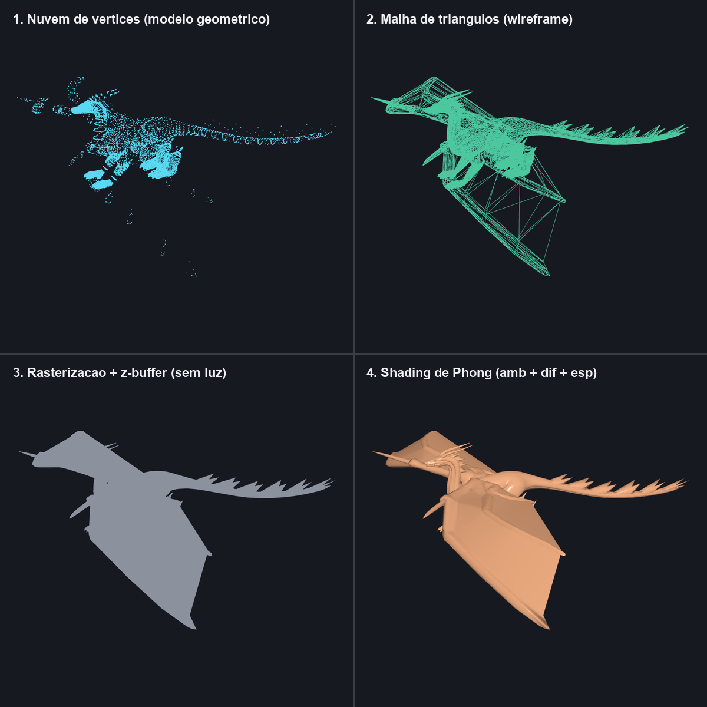

Os quatro quadros são **o mesmo modelo, na mesma câmera**, variando apenas o estágio do pipeline: nuvem de vértices → wireframe → rasterização com *z-buffer* → Phong completo. Fica visível que a "forma" já existe no quadro 1 (é dado de entrada) e que o que os estágios seguintes acrescentam é **aparência**.

### O que isso demonstra sobre a área

* **Entrada:** 19.895 vértices e 37.986 triângulos — 466 KB de números, nenhum pixel.
* **Saída:** imagem 900×900 = 810.000 pixels, em 0,9 ms.
* Nenhuma imagem foi lida como entrada. A imagem foi **sintetizada**.
* O custo é dominado pela rasterização, e não pela leitura do modelo — daí a área ser inseparável do hardware gráfico.

---

## 4. Área 2 — Processamento de Imagens

> *"Técnicas de transformação de imagens descritas como 'matrizes' de pixels. Objetivo: melhorar características visuais (aumentar contraste, melhorar foco, reduzir ruído, eliminar distorções); extrair elementos de interesse; ou mesmo 'transformar' a imagem, criando efeitos visuais."*
> — `aula02/intro_computacao_visual.pdf`, slide 23

### Aplicação escolhida

**OpenCV**, biblioteca padrão da indústria para processamento de imagens.

| Item | Valor |
|---|---|
| Repositório público | <https://github.com/opencv/opencv> |
| Imagens de entrada | `samples/data/fruits.jpg` e `samples/data/smarties.png`, do próprio repositório do OpenCV |
| Programa | [`02_processamento_imagens/processamento_opencv.py`](02_processamento_imagens/processamento_opencv.py) |

Os blocos seguem a estrutura do material `files/PI.pdf`, que organiza a área em aquisição → restauração/realce → segmentação → extração de atributos → classificação.

### (A) Aquisição: resolução espacial e gradação tonal

Reproduz as figuras 3.3 e 3.4 do `PI.pdf`: o efeito da **amostragem** (reduzir a grade de 512×480 para 64×60 e 16×15) e da **quantização** (reduzir de 256 para 16, 4 e 2 níveis por canal). São os dois eixos independentes que definem quanto de informação uma imagem digital carrega.

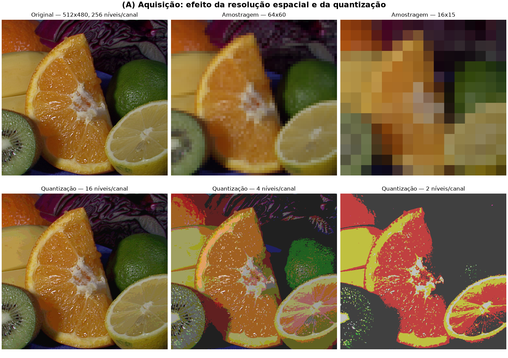

### (B) Realce: o histograma como descritor global

| Imagem | Média | Desvio padrão | Faixa |
|---|---|---|---|
| Tons de cinza (original) | 88,7 | 45,8 | [0, 238] |
| Baixo contraste (simulado) | 59,4 | **20,6** | [20, 127] |
| Equalização de histograma | 129,0 | **74,1** | [0, 255] |
| CLAHE (equalização local) | 81,1 | 33,4 | [10, 188] |

A equalização **triplicou o desvio padrão** (20,6 → 74,1) e espalhou os valores por toda a faixa [0, 255]. O ponto conceitual: a operação não sabe nada sobre o conteúdo — ela apenas redistribui a função de distribuição acumulada dos níveis de cinza.

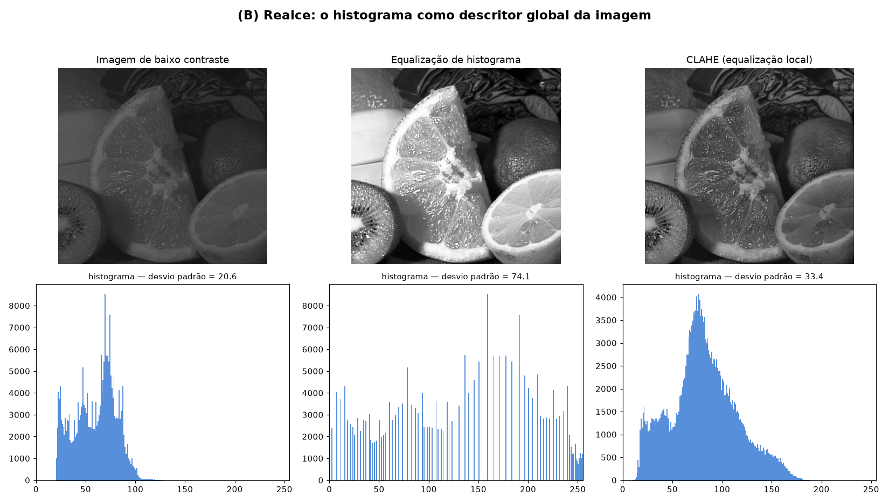

### (C) Restauração: ruído e filtragem

Com 8 % dos pixels corrompidos por ruído sal-e-pimenta:

| Filtro | PSNR |
|---|---|
| imagem ruidosa (sem filtro) | 16,11 dB |
| média 5×5 | 26,49 dB |
| gaussiano 5×5 | 26,26 dB |
| **mediana 3×3** | **35,51 dB** |

A mediana ganha por quase 9 dB usando uma janela *menor* que a dos concorrentes. O motivo é estrutural: é um filtro **não-linear**, e a mediana de um conjunto é imune a valores extremos, enquanto qualquer média ponderada espalha o pixel corrompido pela vizinhança.

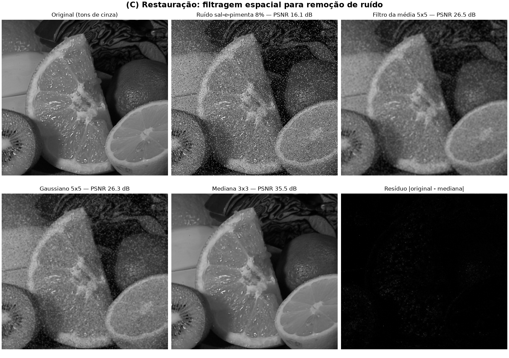

### (D) Realce de bordas: convolução

Máscaras de Sobel aplicadas na vizinhança 3×3, mais o Laplaciano (2ª derivada) e o detector de Canny:

```
Sobel_x = [[-1 0 1]      Sobel_y = [[-1 -2 -1]
           [-2 0 2]                 [ 0  0  0]
           [-1 0 1]]                [ 1  2  1]]
```

O Canny marcou **6.057 pixels de borda — 2,46 % da imagem**. É a operação que mais aproxima esta área da seguinte: reduzir a imagem a suas descontinuidades é o primeiro passo de quase todo sistema de visão.

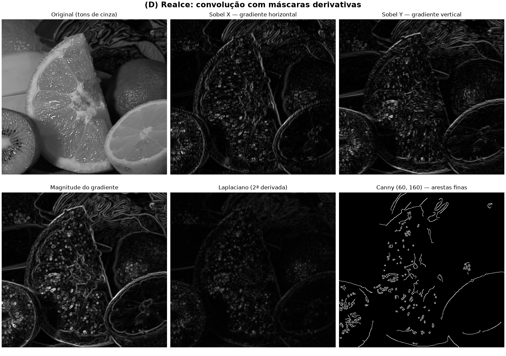

### (E)(F) Segmentação e extração de atributos

A limiarização só faz sentido quando o histograma é **bimodal** (objeto claro sobre fundo escuro, ou o inverso), como ensina o `PI.pdf`. Por isso esta etapa troca de imagem, passando para `smarties.png`.

* Limiar escolhido **automaticamente pelo método de Otsu**: T = 177
* Após a morfologia (abertura + fechamento): **11 contornos** — objetos encostados saem grudados
* Após transformada de distância + **watershed**: **15 marcadores**, **14 regiões** acima de 300 px

Atributos extraídos de cada região: área, perímetro e circularidade `4πA/P²`. As regiões inteiras convergem para circularidade ≈ 0,89 (o valor teórico de um círculo é 1,0; a discretização em pixels custa o resto), e as duas regiões cortadas pela borda da imagem caem para 0,73 e 0,59 — o próprio atributo denuncia que o objeto está incompleto.

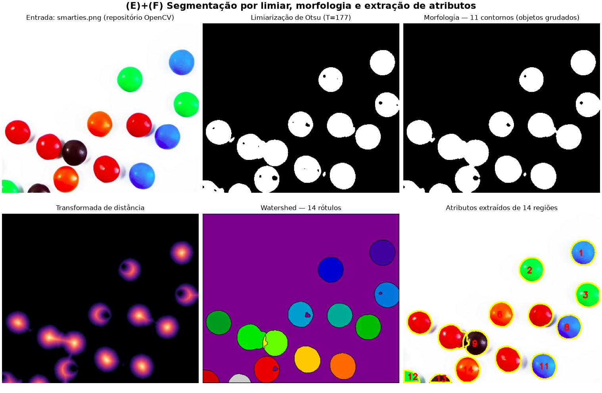

### O que isso demonstra sobre a área

* **Entrada:** imagem matricial 512×480×3. **Saída:** imagem matricial 512×480 — a mesma natureza de dado.
* A informação é sempre reorganizada **dentro da própria grade de pixels**.
* O sistema não sabe que são frutas ou confeitos: ele conhece intensidades e vizinhanças. Área, perímetro e circularidade são **atributos geométricos**, não semânticos. Dar nome ao objeto é o trabalho da área seguinte.

---

## 5. Área 3 — Visão Computacional (Visão Artificial)

> *"Colocar 'o sentido' da visão na máquina. Problema extremamente complexo — visão requer inteligência! Problema mais delimitado: reconhecimento de padrões em imagens. p.ex. https://pjreddie.com/darknet/yolo/"*
> — `aula02/intro_computacao_visual.pdf`, slide 28

### Aplicação escolhida

**YOLO** — o próprio exemplo citado pelo slide — na implementação **Ultralytics**, com pesos `yolov8n.pt` pré-treinados no conjunto COCO.

| Item | Valor |
|---|---|
| Repositório público | <https://github.com/ultralytics/ultralytics> |
| Pesos | `yolov8n.pt` (<https://github.com/ultralytics/assets>) — 3.157.200 parâmetros, 80 classes |
| Imagem de entrada | `bus.jpg` (<https://github.com/ultralytics/assets>) |
| Programa | [`03_visao_computacional/visao_yolo.py`](03_visao_computacional/visao_yolo.py) |

O programa é organizado segundo os **seis passos do "típico sistema de visão"** dos slides 31 a 45.

### Passo 1 — Aquisição
`bus.jpg`, 810×1080×3 = 2.624.400 bytes brutos.

### Passo 2 — Pré-processamento

```
letterbox ..................: 810x1080 -> 640x640 (escala 0.593, borda dx=80 dy=0)
BGR -> RGB, HWC -> NCHW ....: tensor (1, 3, 640, 640)
normalização ...............: uint8 [0,255] -> float32 [0,1]
```

Todas as operações desta etapa — redimensionamento com preservação de proporção, preenchimento de borda, conversão de espaço de cor, normalização — **são Processamento de Imagens**. É aqui que a Área 2 entra como serviço da Área 3.

### Passos 3 e 5 — Processamento e extração de características

| Bloco | Formato do mapa | Interpretação |
|---|---|---|
| 0 | (1, 16, 320, 320) | 16 filtros de 320×320 — bordas e gradientes |
| 2 | (1, 32, 160, 160) | 32 filtros de 160×160 — texturas e contornos |
| 4 | (1, 64, 80, 80) | 64 filtros de 80×80 — partes de objeto |
| 6 | (1, 128, 40, 40) | 128 filtros de 40×40 — padrões semânticos |

Passagem direta na CPU: **116 ms**.

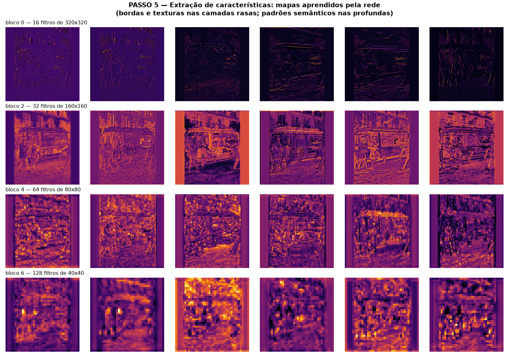

Esta figura é o coração da diferença entre as áreas 2 e 3. Os mapas do bloco 0 são **visualmente indistinguíveis de uma saída de Sobel** — a rede redescobriu, sozinha, detectores de borda. Mas conforme se desce na rede, a resolução espacial cai e o número de canais sobe: a representação deixa de ser "uma imagem" e passa a ser "um vetor de evidências". É a transição de pixel para significado, acontecendo em camadas.

### Passos 4 e 6 — Análise e reconhecimento

Inferência completa com supressão de não-máximos (IoU 0,45; confiança mínima 0,25): **1.465 ms**.

| # | Classe | Confiança | Caixa (x1,y1,x2,y2) | Área (px) |
|---|---|---|---|---|
| 1 | bus | 0,873 | 23, 231, 805, 757 | 411.059 |
| 2 | person | 0,866 | 49, 399, 245, 903 | 99.214 |
| 3 | person | 0,853 | 670, 392, 810, 877 | 67.999 |
| 4 | person | 0,825 | 222, 406, 345, 858 | 55.769 |
| 5 | person | 0,261 | 0, 550, 63, 873 | 20.346 |
| 6 | stop sign | 0,255 | 0, 254, 33, 325 | 2.288 |

Interpretação da cena: **1× bus, 4× person, 1× stop sign**.

### Contraste: características projetadas à mão × aprendidas

Para mostrar o que a área ganhou nos últimos vinte anos, o mesmo problema foi resolvido com **HOG + SVM** (Dalal & Triggs, 2005), o detector clássico que ainda acompanha o OpenCV:

| | HOG + SVM | YOLOv8n |
|---|---|---|
| Descritor | escrito à mão | aprendido dos dados |
| Classes que sabe procurar | 1 (pedestres) | 80 |
| Detecções | 3 pessoas | 4 pessoas + ônibus + placa |
| Tempo | 739 ms | 1.465 ms |

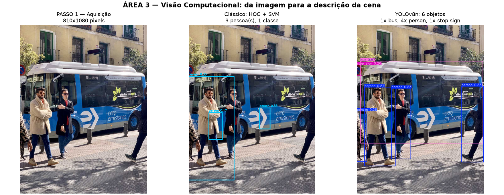

A imagem deixa claro o que os números escondem: as caixas do HOG são frouxas e mal posicionadas, e o detector não tem sequer vocabulário para dizer "ônibus".

### O que isso demonstra sobre a área

* **Entrada:** imagem matricial 810×1080×3 = 2.624.400 bytes.
* **Saída:** descrição simbólica — 6 registros, **974 bytes de JSON**.
* Uma **redução de 2.694×** no volume de dados: a área troca pixels por **significado**.
* A imagem anotada é apenas para o humano ver. O produto real da Visão Computacional é a **lista de objetos** — é ela que alimenta o freio automático, o catálogo, o alarme.

---

## 6. Área 4 — Visualização Computacional

> *"Técnicas da CG para representar dado/informação: representações gráficas de dados, numéricos ou não. Objetivos: facilitar o entendimento de fenômenos complexos e a exploração de diferentes cenários. Síntese para gerar as representações visuais, análise (pelo usuário) para extrair informações."*
> — `aula02/intro_computacao_visual.pdf`, slide 47

O mesmo material (slide 50) separa a área em duas frentes, e ambas foram executadas:

* **SciVis** — a geometria do modelo é **determinada pelo domínio**; modelos complexos, interpretação intuitiva.
* **InfoVis** — a geometria é **atribuída pelo projetista**; modelos simples, interpretação requer treinamento.

### Parte A — Visualização Científica

| Item | Valor |
|---|---|
| Repositórios públicos | <https://github.com/Kitware/VTK> · <https://github.com/pyvista/pyvista> |
| Dado | tomografia computadorizada de joelho, de <https://github.com/pyvista/vtk-data> |
| Programa | [`04_visualizacao_computacional/visualizacao_vtk.py`](04_visualizacao_computacional/visualizacao_vtk.py) |

A escolha vem direto do slide 54, que exibe um *"Rendering Volumétrico Direto: ray casting no Visualization Toolkit"*.

**O dado de entrada:**

```
dimensões da grade .........: 208 x 248 x 201
total de voxels ............: 10.368.384
espaçamento (mm) ...........: (0.723, 0.723, 1.0)
faixa de intensidade .......: 0 a 174
memória do campo ...........: 9,9 MB
```

Não é uma imagem e não é uma malha: é uma **função `f(x,y,z)` medida**. Não existe superfície nenhuma no arquivo — só valores. É essa a diferença essencial em relação à Área 1.

O histograma do campo é o que orienta todas as decisões seguintes:

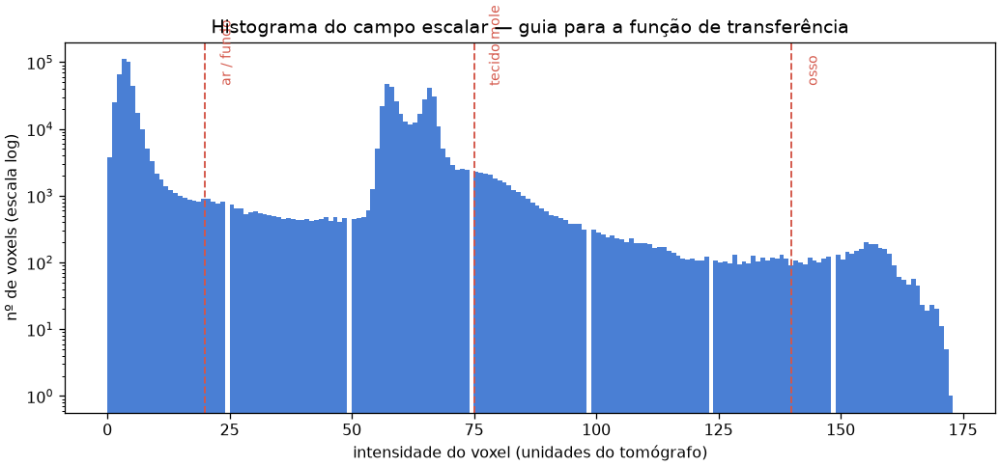

Três técnicas foram aplicadas sobre o **mesmo** dado:

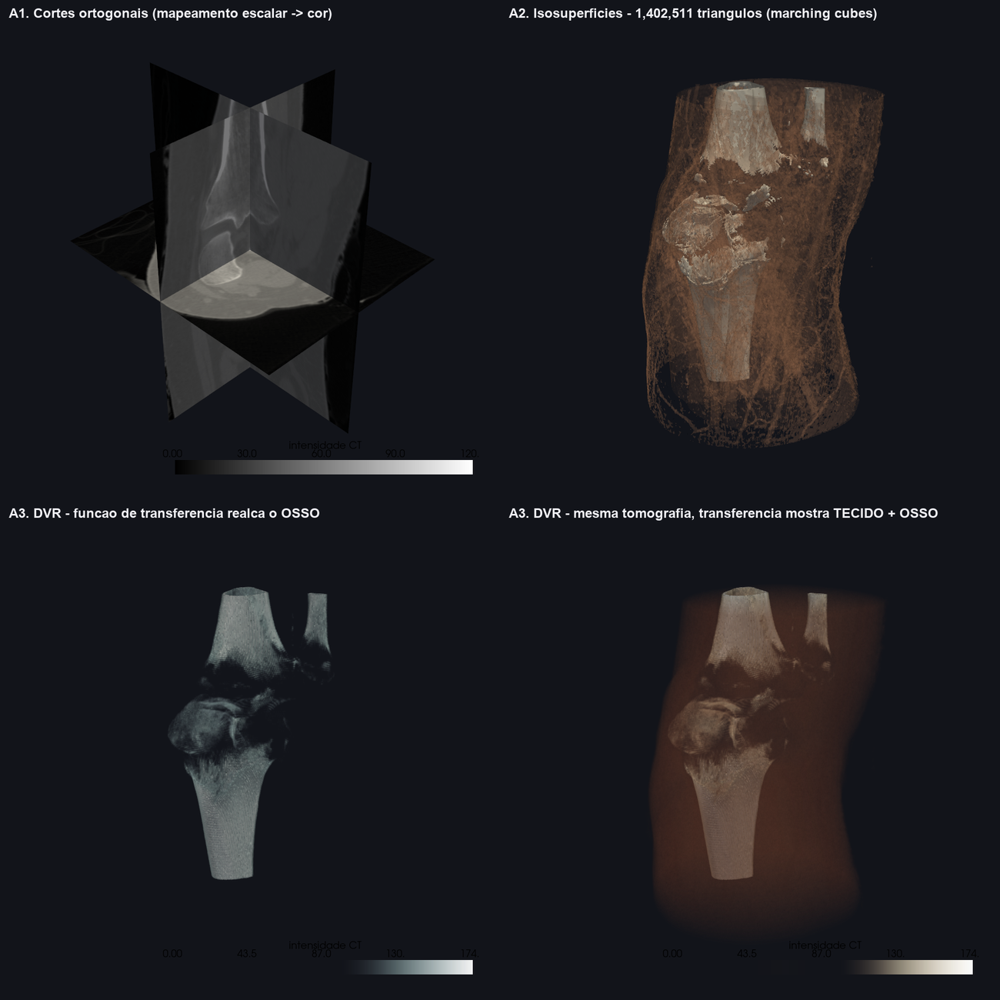

1. **Cortes ortogonais** — o mapeamento mais direto possível: intensidade → cor, sem construir geometria alguma.
2. **Isosuperfície** (*marching cubes*) — extrai geometria do campo e devolve o problema ao pipeline da Área 1: isovalor 62 (tecido mole) → 1.226.157 triângulos; isovalor 108 (osso) → 176.354 triângulos. Note o custo: **1,4 milhão de triângulos** para representar aquilo que o DVR mostra sem gerar um único polígono.
3. **Rendering Volumétrico Direto** (*ray casting*) — o raio de cada pixel atravessa o volume acumulando cor e opacidade. Nenhuma superfície é construída.

O que decide o que aparece no DVR é a **função de transferência**, que mapeia valor de voxel em opacidade. Com pontos de controle em `[0, 34, 69, 104, 139, 174]`:

| Função de transferência | Opacidades | Resultado |
|---|---|---|
| realce do osso | `[0, 0, 0, 0.05, 0.60, 0.95]` | tecido mole invisível, osso sólido |
| osso + tecido | `[0, 0, 0.01, 0.06, 0.70, 0.98]` | pele translúcida, osso visível por dentro |

Os dois últimos quadros da montagem são **exatamente a mesma tomografia, a mesma câmera e o mesmo algoritmo** — muda só a função de transferência. Essa é a demonstração mais limpa de que, em Visualização, **a decisão de projeto é o mapeamento, não a forma**.

### Parte B — Visualização de Informação

| Item | Valor |
|---|---|
| Repositórios públicos | <https://github.com/matplotlib/matplotlib> · dados de <https://github.com/plotly/datasets> |
| Dado | `gapminder2007.csv` — 142 países × 5 variáveis, 19 KB |

Reprodução do gráfico do **Gapminder**, citado no slide 62. A tabela de entrada não tem geometria nenhuma associada: **um país não tem posição (x, y) natural — ela precisa ser inventada**.

Mapeamento visual escolhido pelo projetista:

| Canal visual | Variável |
|---|---|
| posição X | PIB per capita (US$, escala logarítmica) |
| posição Y | expectativa de vida (anos) |
| área do círculo | população |
| cor | continente (categórica) |

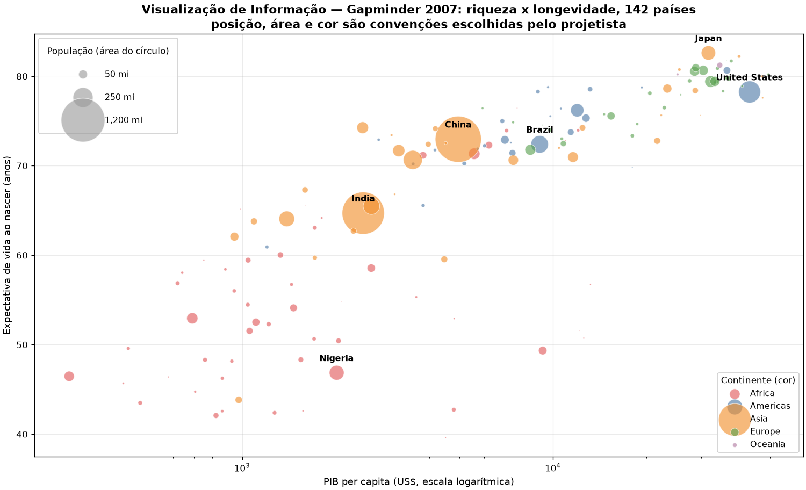

Leitura possibilitada pelo gráfico:

* correlação log(PIB) × expectativa de vida = **0,809**
* expectativa de vida varia de 39,6 a 82,6 anos — **43 anos de diferença** entre o pior e o melhor caso

| Continente | n | Vida média | PIB mediano |
|---|---|---|---|
| Africa | 52 | 54,8 anos | US$ 1.452 |
| Americas | 25 | 73,6 anos | US$ 8.948 |
| Asia | 33 | 70,7 anos | US$ 4.471 |
| Europe | 30 | 77,6 anos | US$ 28.054 |
| Oceania | 2 | 80,7 anos | US$ 29.810 |

### O que isso demonstra sobre a área

* **Entrada:** dados que não são imagem nem modelo geométrico de um objeto — um campo escalar medido (10,3 milhões de voxels) e uma tabela de indicadores (142 linhas).
* **Saída:** imagem cujo propósito é **análise**, não realismo.
* A área compartilha o motor de renderização da Área 1, mas o produto é entendimento: a pergunta não é *"ficou bonito?"*, e sim *"ficou legível?"*.
* O contraste SciVis × InfoVis fica explícito na comparação: a forma do joelho **veio do tomógrafo**; a posição do Brasil no gráfico **foi escolhida por quem desenhou o gráfico**. Ler o joelho é intuitivo; ler o Gapminder exige saber que o eixo X é logarítmico e que é a *área* — não o raio — que codifica a população.

---

## 7. Conclusão: o que separa e o que une as quatro áreas

**O que separa** é o par (entrada, saída), demonstrado numericamente pelas execuções:

| Área | Entrada medida | Saída medida | Transformação |
|---|---|---|---|
| Síntese | 19.895 vértices / 37.986 triângulos (466 KB) | imagem 900×900 (810.000 px) | **expande** geometria em pixels |
| Processamento | imagem 512×480×3 | imagem 512×480 | **preserva** o domínio |
| Visão | imagem 810×1080×3 (2,6 MB) | 6 objetos (974 bytes) | **comprime** 2.694× em significado |
| Visualização | 10.368.384 voxels (9,9 MB) / 142 linhas (19 KB) | imagem 900×900 para análise | **traduz** dado em forma visível |

**O que une** apareceu sozinho durante a execução, sem ter sido forçado:

* A Área 3 **usa a Área 2**: todo o Passo 2 do YOLO — *letterbox*, conversão de espaço de cor, normalização — é Processamento de Imagens puro.
* A Área 3 **redescobriu a Área 2**: os mapas de características do bloco 0 do YOLO são detectores de borda, visualmente equivalentes ao Sobel da Área 2. A diferença é que um foi escrito por uma pessoa e o outro foi aprendido de dados.
* A Área 4 **usa a Área 1**: a isosuperfície por *marching cubes* produz 1,4 milhão de triângulos que são rasterizados exatamente pelo pipeline da Área 1. O DVR é a alternativa que dispensa esse passo.
* As Áreas 1 e 4 **compartilham o motor e divergem no objetivo**: as duas fazem `dados → imagem`, mas uma persegue realismo e a outra, legibilidade.

O ponto do slide 66 — *identidade própria, focos distintos, técnicas compartilhadas* — não é uma ressalva acadêmica. É o que se observa assim que os quatro programas são executados lado a lado.

---

## 8. Estrutura da entrega

```
AC1-Entrega/
├── README.md                       este documento
├── requirements.txt                versões exatas usadas na execução
├── executar_tudo.py                roda as quatro áreas em sequência
├── assets/                         dados de entrada (repositórios públicos)
│   ├── fruits.jpg                  opencv/opencv · samples/data
│   ├── smarties.png                opencv/opencv · samples/data
│   ├── bus.jpg                     ultralytics/assets
│   └── gapminder2007.csv           plotly/datasets
├── 00_comparativo/                 diagrama e painel das quatro áreas
├── 01_sintese_imagens/             ModernGL / OpenGL 3.3 Core
├── 02_processamento_imagens/       OpenCV
├── 03_visao_computacional/         Ultralytics YOLOv8n + HOG/SVM
├── 04_visualizacao_computacional/  VTK/PyVista + Matplotlib
└── relatorio/
    └── log_execucao.txt            saída de console das cinco execuções
```

## 9. Referências

**Material da disciplina**

* `aula01/intro.pdf` — sub-áreas da Computação Gráfica (slide 12)
* `aula02/intro_computacao_visual.pdf` — definição das quatro áreas (slides 15, 23, 28, 47, 50, 66)
* `aula02/bibliotecas_graficas.pdf` — OpenGL moderna e o pipeline gráfico (slides 15–25)
* `files/PI.pdf` — Processamento de Imagens: aquisição, realce, segmentação, extração de atributos
* `aula08/objetos/dragao.obj` — modelo usado na Área 1

**Repositórios públicos executados**

| Área | Projeto | Endereço |
|---|---|---|
| 1 | ModernGL | <https://github.com/moderngl/moderngl> |
| 2 | OpenCV | <https://github.com/opencv/opencv> |
| 3 | Ultralytics YOLO | <https://github.com/ultralytics/ultralytics> |
| 3 | Ultralytics assets (pesos e imagens) | <https://github.com/ultralytics/assets> |
| 4 | VTK — Visualization Toolkit | <https://github.com/Kitware/VTK> |
| 4 | PyVista | <https://github.com/pyvista/pyvista> |
| 4 | vtk-data (tomografia) | <https://github.com/pyvista/vtk-data> |
| 4 | Matplotlib | <https://github.com/matplotlib/matplotlib> |
| 4 | plotly/datasets (Gapminder) | <https://github.com/plotly/datasets> |

**Algoritmos citados**

* Otsu, N. (1979). *A threshold selection method from gray-level histograms.*
* Canny, J. (1986). *A computational approach to edge detection.*
* Lorensen, W. & Cline, H. (1987). *Marching cubes: a high resolution 3D surface construction algorithm.*
* Phong, B. T. (1975). *Illumination for computer generated pictures.*
* Dalal, N. & Triggs, B. (2005). *Histograms of oriented gradients for human detection.*
* Redmon, J. et al. (2016). *You Only Look Once: unified, real-time object detection.*
