# Transformações Geométricas 2D — os dez exercícios, executados

**Disciplina:** Computação Gráfica I · **Professor:** Jonh Edson
**Atividade:** [`AC02.md`](AC02.md) — Estudo Dirigido 02: resolver e **plotar com Matplotlib** dez exercícios de transformação geométrica no plano (translação, escala, rotação, reflexão, cisalhamento e composições).

Os dez exercícios foram resolvidos, plotados e **verificados numericamente**. Nenhum número deste documento foi digitado à mão: todos vêm da execução registrada em [`saida/log_execucao.txt`](saida/log_execucao.txt) e em [`saida/resultados.json`](saida/resultados.json).


---

## 1. Decisão de projeto: uma matriz 3×3 para um problema 2D

O enunciado sugere resolver cada exercício com a operação aritmética direta (`pontos + [4, -2]` para transladar, `pontos * 2` para escalar). Isso funciona exercício por exercício, mas quebra no exercício 9 — e o motivo é o ponto central da aula 04.

**A translação não é uma transformação linear.** Ela não pode ser escrita como matriz 2×2, porque `T(0) ≠ 0`. Então, enquanto escala e rotação são multiplicações, a translação é uma soma — e "multiplicar depois somar depois multiplicar" não colapsa em uma operação só.

Em **coordenadas homogêneas** o ponto `(x, y)` passa a ser o vetor-coluna `[x, y, 1]ᵀ` e a translação vira a terceira coluna de uma matriz 3×3. Com isso as cinco famílias de transformação viram o *mesmo tipo de objeto*, e qualquer sequência delas colapsa em **uma única matriz**:

```
| x' |   | a  b  tx |   | x |
| y' | = | c  d  ty | · | y |
| 1  |   | 0  0  1  |   | 1 |
```

É por isso que [`transformacoes.py`](transformacoes.py) implementa tudo em 3×3, mesmo custando uma dimensão extra em um problema plano.

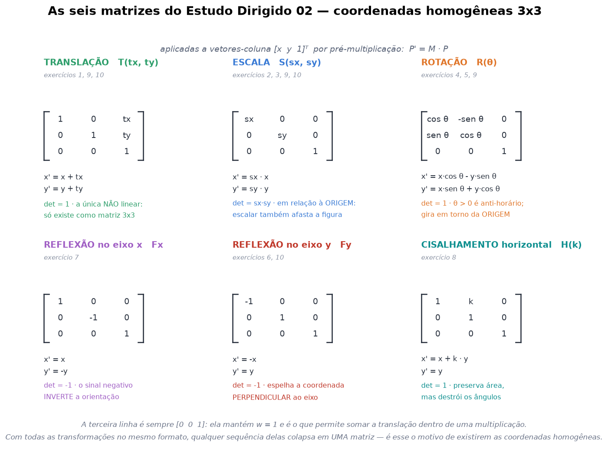

**Convenções** adotadas em todo o trabalho, seguindo o material da disciplina:

| Item | Escolha |
|---|---|
| Vetores | coluna, com **pré**-multiplicação: `P' = M · P` |
| Ângulo positivo | sentido **anti-horário** (logo, "45° horário" ⇒ `θ = −45°`) |
| Eixo y | aponta para **cima** (ao contrário da matriz de pixels) |
| Centro de escala e rotação | a **origem** — o que tem consequência visível nos exercícios 2 e 5 |

---

## 2. Como executar

```bash
python -m venv .venv
.venv\Scripts\activate            # Windows
pip install -r requirements.txt

python executar_tudo.py
```

Ambiente da execução registrada: **Python 3.12.0 · numpy 2.5.3 · matplotlib 3.11.1 · Windows 11**. Tempo total: **4,27 s**, produzindo **14 figuras**, o JSON de resultados e o log.

O `executar_tudo.py` roda os dez exercícios, as quatro figuras de síntese e as **11 verificações algébricas** da seção 6 — e falha se qualquer uma delas não passar.

> **Nota sobre `plt.show()`:** o enunciado usa `plt.show()`, que abre janela e bloqueia. Aqui o backend é o `Agg` e as figuras são gravadas em `saida/*.png`. A plotagem é a mesma; a diferença é que a execução fica reprodutível e registrável em log, o que a entrega precisa.

---

## 3. As respostas, em uma tabela

| # | Exercício | Entrada | Resposta |
|---|---|---|---|
| 1 | Translação simples | P(2, 3), vetor (4, −2) | **P′(6, 1)** |
| 2 | Escala uniforme ×2 | A(1,1) B(3,1) C(2,4) | **A′(2,2) B′(6,2) C′(4,8)** |
| 3 | Escala não uniforme (2 ; 0,5) | o mesmo triângulo | **A′(2; 0,5) B′(6; 0,5) C′(4,2)** |
| 4 | Rotação +90° | P(1, 0) | **P′(0, 1)** |
| 5 | Rotação 45° horária | A(1,1) B(1,4) C(4,4) D(4,1) | **A′(1,4142; 0) B′(3,5355; 2,1213) C′(5,6569; 0) D′(3,5355; −2,1213)** |
| 6 | Reflexão no eixo y | P(2, 5) | **P′(−2, 5)** |
| 7 | Reflexão no eixo x | A(2,3) B(4,3) C(3,5) | **A′(2,−3) B′(4,−3) C′(3,−5)** |
| 8 | Cisalhamento horizontal k=2 | P(2, 3) | **P′(8, 3)** |
| 9 | Composição T → R → S | P(3, 2) | **P′(−2, 8)** |
| 10 | Composição T → S → F<sub>y</sub> | A(1,1) B(5,1) C(5,3) D(1,3) | **A′(1,5; 2) B′(−4,5; 2) C′(−4,5; 3) D′(1,5; 3)** |

---

## 4. Exercício por exercício

### Exercício 1 — Translação simples

> Dado P(2, 3), aplique a translação com vetor (4, −2).

```
          |  1   0   4 |
T(4,-2) = |  0   1  -2 |
          |  0   0   1 |
```

**P′ = (6, 1).** **As duas coordenadas** foram alteradas: x de 2 para 6 (+4) e y de 3 para 1 (−2). A distância percorrida é `√(4² + 2²) = 4,4721`.

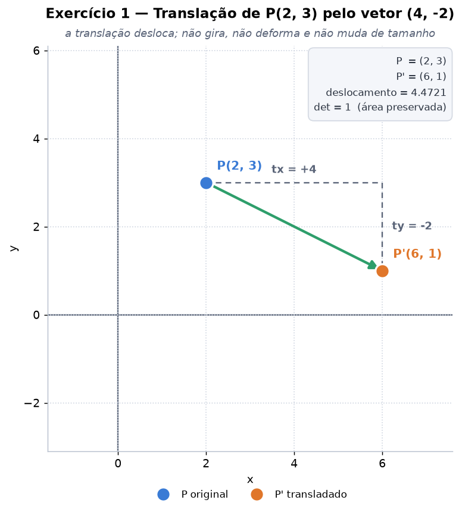

O determinante da parte linear é 1: a translação move, mas não gira, não deforma e não altera tamanho. É também a única das transformações do estudo que **não é linear** — e a razão de existir a terceira dimensão nas matrizes.

---

### Exercício 2 — Escala uniforme

> Triângulo A(1,1), B(3,1), C(2,4) com escala uniforme de fator 2.

```
         | 2  0  0 |
S(2,2) = | 0  2  0 |
         | 0  0  1 |
```

**A′(2, 2), B′(6, 2), C′(4, 8).**

| Medida | Antes | Depois | Fator |
|---|---|---|---|
| Área | 3,0000 | 12,0000 | **×4 = 2²** |
| Perímetro | 8,3246 | 16,6491 | ×2 |
| Ângulos internos | 71,57° / 71,57° / 36,87° | 71,57° / 71,57° / 36,87° | **inalterados** |
| Baricentro | (2, 2) | (4, 4) | — |

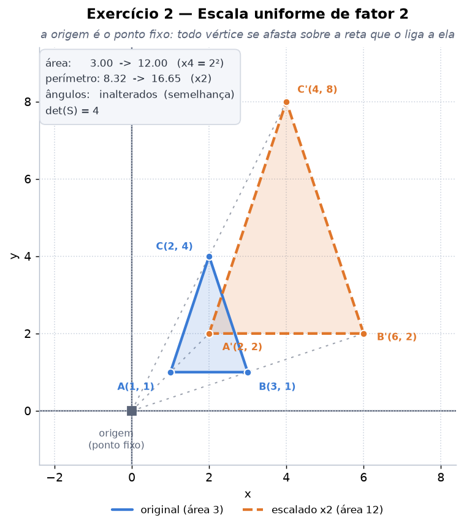

**O que acontece com o tamanho:** cada dimensão *linear* dobra, então a **área quadruplica** — o fator de área é `det(S) = 4`, não 2. É o erro clássico de estimativa nessa transformação.

Duas observações que a figura entrega e a lista de coordenadas esconde:

* Os ângulos internos não mudam. A escala uniforme é uma **semelhança**: preserva a forma, altera só o tamanho.
* A escala é **em relação à origem**, então ela também *afasta* a figura — o baricentro sai de (2,2) e vai para (4,4). As retas pontilhadas na figura mostram cada vértice deslizando sobre a reta que o liga à origem. A origem é o único ponto fixo.

---

### Exercício 3 — Escala não uniforme

> O mesmo triângulo, com fator 2 em x e 0,5 em y.

```
             | 2.0  0.0  0.0 |
S(2 , 0.5) = | 0.0  0.5  0.0 |
             | 0.0  0.0  1.0 |
```

**A′(2; 0,5), B′(6; 0,5), C′(4, 2).**

| Medida | Antes | Depois |
|---|---|---|
| Área | 3,0000 | **3,0000** |
| Perímetro | 8,3246 | 9,0000 |
| Ângulos internos | 71,57° / 71,57° / 36,87° | **36,87° / 36,87° / 106,26°** |

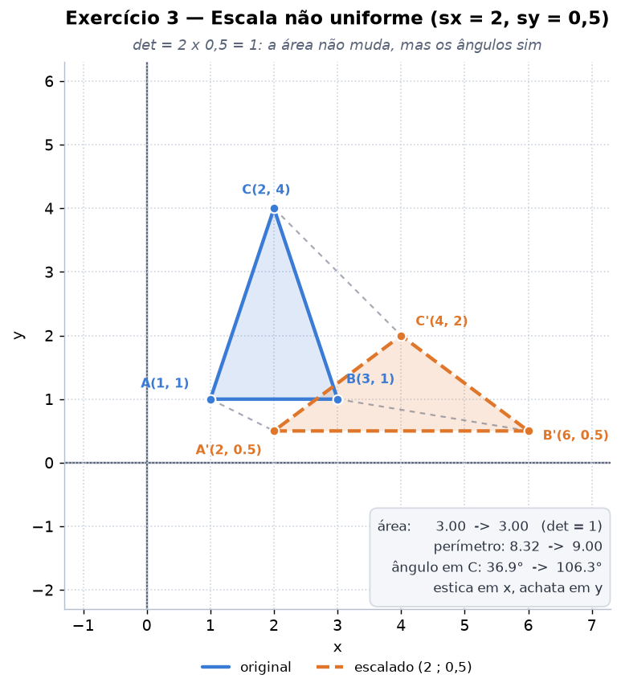

Este é o caso mais instrutivo dos dez. Como `det(S) = 2 × 0,5 = 1`, a **área se mantém exatamente em 3,0** — e ainda assim o triângulo está visivelmente deformado. O que se perdeu não foi área: foram os **ângulos**, que mudaram todos. A escala não uniforme é uma transformação **afim, mas não uma semelhança**: ela achata em y exatamente o quanto estica em x.

Ou seja: área preservada não é sinônimo de forma preservada.

---

### Exercício 4 — Rotação em torno da origem

> Rotacione P(1, 0) em 90° anti-horário.

```
R(θ) = | cos θ   -sen θ   0 |            |  0  -1   0 |
       | sen θ    cos θ   0 |   θ=90° => |  1   0   0 |
       |   0        0     1 |            |  0   0   1 |
```

**P′ = (0, 1)** — o ponto sai do eixo x e para sobre o eixo y. O raio até a origem (1,0000) é preservado; só o ângulo polar muda, de 0° para 90°.

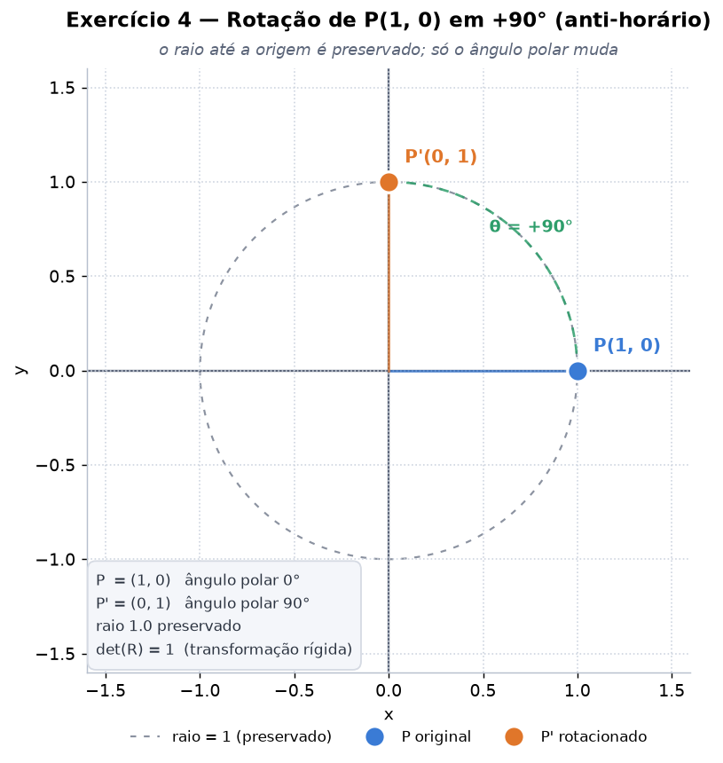

Vale reparar *onde* o resultado está na matriz: as colunas de `R` são as imagens dos vetores da base canônica. Como P(1,0) **é** o primeiro vetor da base, P′ é literalmente a primeira coluna de `R`. Isso serve de conferência mental rápida para qualquer matriz de transformação.

---

### Exercício 5 — Rotação de um polígono

> Quadrado A(1,1), B(1,4), C(4,4), D(4,1), rotação de 45° **no sentido horário**.

Sentido horário ⇒ `θ = −45°`, com `cos(−45°) = +√2/2 ≈ 0,7071` e `sen(−45°) = −√2/2`:

```
          |  0.7071   0.7071   0.0000 |
R(-45°) = | -0.7071   0.7071   0.0000 |
          |  0.0000   0.0000   1.0000 |
```

| Vértice | Original | Rotacionado |
|---|---|---|
| A | (1, 1) | **(1,4142; 0)** |
| B | (1, 4) | **(3,5355; 2,1213)** |
| C | (4, 4) | **(5,6569; 0)** |
| D | (4, 1) | **(3,5355; −2,1213)** |

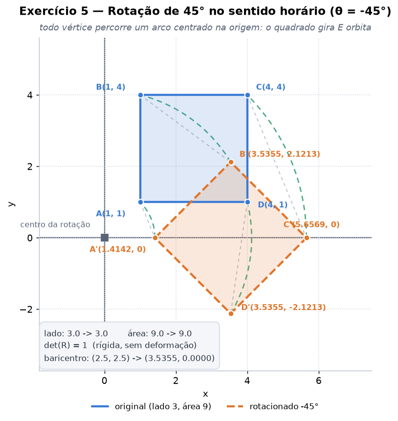

Continua sendo um quadrado: os quatro lados medem 3 antes e depois, a área com sinal é −9 nos dois casos, `det(R) = 1`. Rotação é uma **transformação rígida**.

O detalhe que só a figura revela: o **baricentro saiu de (2,5; 2,5) e foi para (3,5355; 0)**. Como a rotação é em torno da **origem** e o quadrado não está centrado nela, ele não gira apenas — ele também **orbita**. Os arcos tracejados na figura são o caminho real de cada vértice.

Girar a figura *no próprio lugar* exigiria compor três transformações — levar o centro à origem, girar, devolver:

```
T(2,5; 2,5) · R(−45°) · T(−2,5; −2,5)
```

Essa identidade é uma das verificações automáticas da seção 6.

---

### Exercício 6 — Reflexão simples

> Dado P(2, 5), reflita em relação ao eixo y.

```
     | -1   0   0 |
Fy = |  0   1   0 |
     |  0   0   1 |
```

**P′ = (−2, 5).** Só o sinal de x troca; y fica intacto — refletir *em relação ao eixo y* espelha a coordenada **perpendicular** a esse eixo. A distância ao espelho (2) é a mesma dos dois lados.

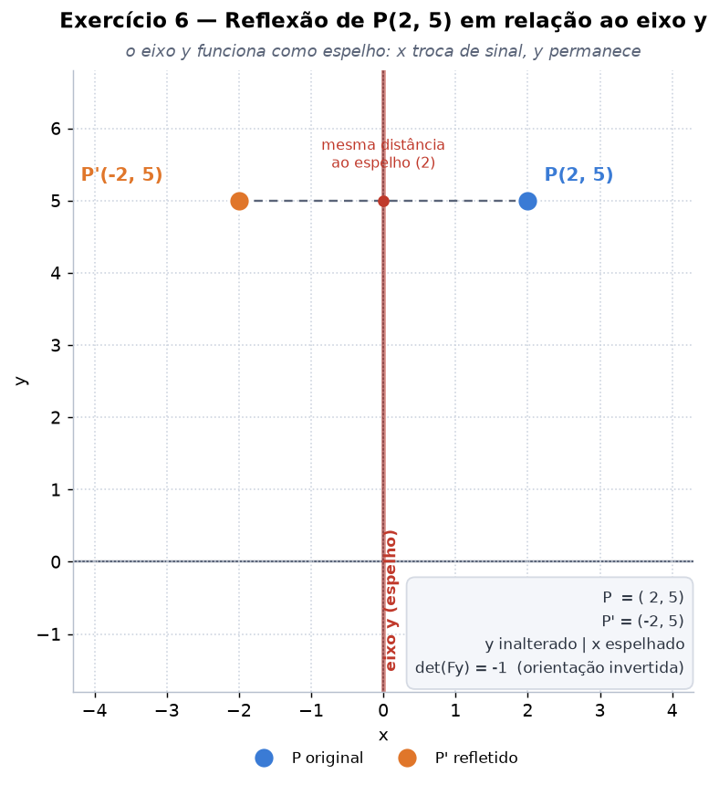

`det(Fy) = −1` é a assinatura da reflexão: **módulo 1** (não altera tamanhos) e **sinal negativo** (inverte a orientação). O exercício seguinte mostra o que esse sinal significa em uma figura.

---

### Exercício 7 — Reflexão de um triângulo

> Triângulo A(2,3), B(4,3), C(3,5), reflexão em relação ao eixo x.

```
     |  1   0   0 |
Fx = |  0  -1   0 |
     |  0   0   1 |
```

**A′(2, −3), B′(4, −3), C′(3, −5)** — todos os y trocam de sinal.

| Medida | Antes | Depois |
|---|---|---|
| Área com sinal | **+2,0000** | **−2,0000** |
| Sentido dos vértices | anti-horário | **horário** |
| Perímetro | 6,4721 | 6,4721 |

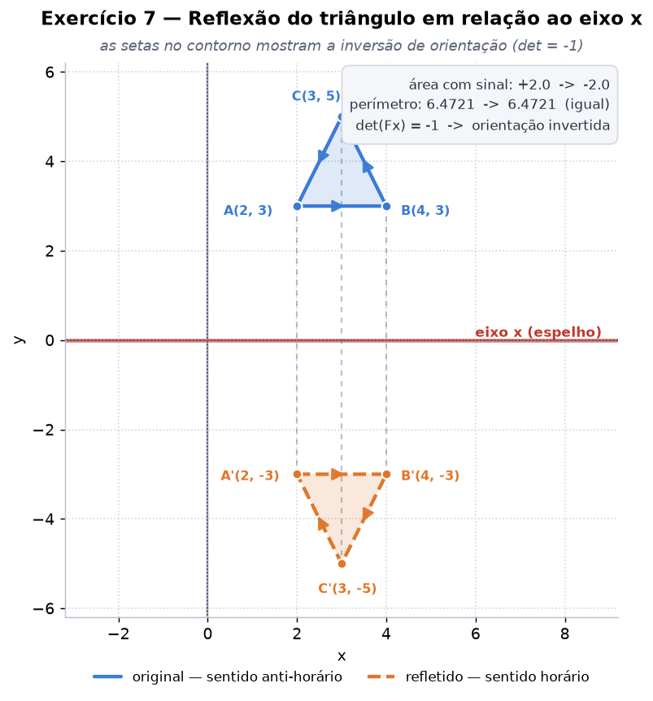

A lista de coordenadas não mostra o efeito mais importante, mas a **área com sinal** mostra: a ordem A→B→C era anti-horária (+2) e passou a ser horária (−2). As setas no contorno da figura são isso desenhado.

Essa é a diferença concreta entre reflexão e rotação. As duas preservam distâncias e ângulos, mas **nenhum giro no plano leva o triângulo original ao refletido** — seria preciso tirá-lo do plano e virá-lo. Por isso `det(Fx) = −1` e não +1.

---

### Exercício 8 — Cisalhamento horizontal

> Dado P(2, 3), aplique cisalhamento horizontal com k = 2.

```
         | 1  2  0 |          x' = x + k·y = 2 + 2×3 = 8
H(k=2) = | 0  1  0 |          y' = y             = 3
         | 0  0  1 |
```

**P′ = (8, 3)** — x salta de 2 para 8, y continua 3.

O ponto sozinho não explica a transformação, então a figura acrescenta um retângulo de referência que tem P como vértice:

| Retângulo | Vértices | Área | Perímetro |
|---|---|---|---|
| Original | (0,0) (2,0) (2,3) (0,3) | 6,0 | 10,0000 |
| Cisalhado | (0,0) (2,0) **(8,3)** (6,3) | **6,0** | 17,4164 |

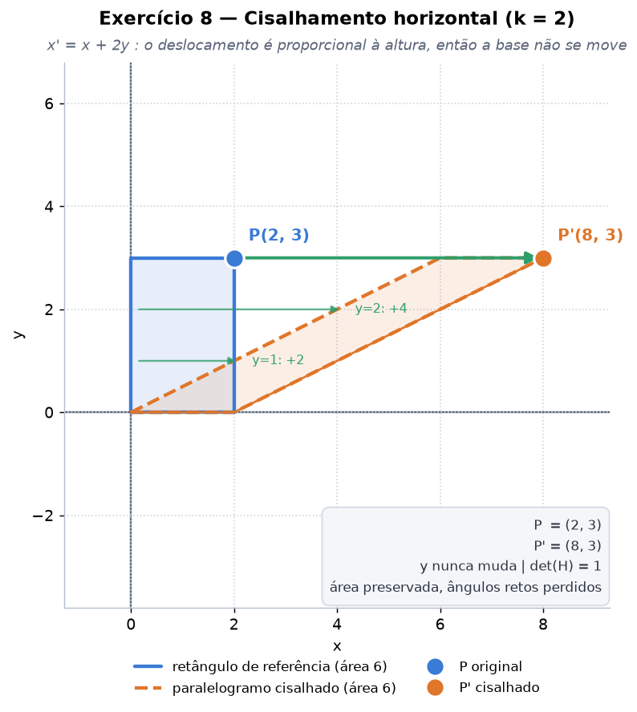

O deslocamento horizontal é **proporcional à altura**: quem está em `y = 0` não sai do lugar, quem está em `y = 3` anda 6 unidades. É por isso que o retângulo vira um paralelogramo — a base fica parada e o topo desliza.

Como base e altura não mudam, `det(H) = 1` e a **área é preservada** — mas os ângulos retos se perdem (o perímetro cresce 74%). Cisalhamento preserva área sem ser uma transformação rígida.

---

### Exercício 9 — Composição de transformações

> Dado P(3, 2): (1) translação (1, −1); (2) rotação +90°; (3) escala uniforme 2.

Passo a passo:

```
1) translação (1, -1) : (3, 2)   ->  (4, 1)
2) rotação +90°       : (4, 1)   ->  (-1, 4)
3) escala uniforme 2  : (-1, 4)  ->  (-2, 8)
```

**P′ = (−2, 8).**

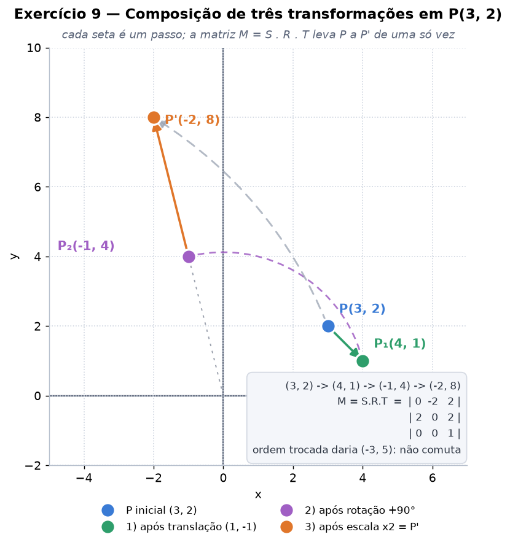

O ponto do exercício, porém, não é o resultado: é que as três transformações colapsam em **uma matriz só**.

```
M = S · R · T                |  0  -2   2 |
                        M =  |  2   0   2 |
                             |  0   0   1 |
```

`M · P` dá (−2, 8) diretamente, conferindo com o passo a passo (verificado na execução). Note que **a ordem de escrita é a inversa da ordem de aplicação**: em pré-multiplicação, a matriz mais à direita é a primeira a agir no ponto.

E a ordem importa. Aplicando as **mesmas três transformações** na ordem invertida (escala, rotação, translação), o mesmo P(3,2) vai para **(−3, 5)**:

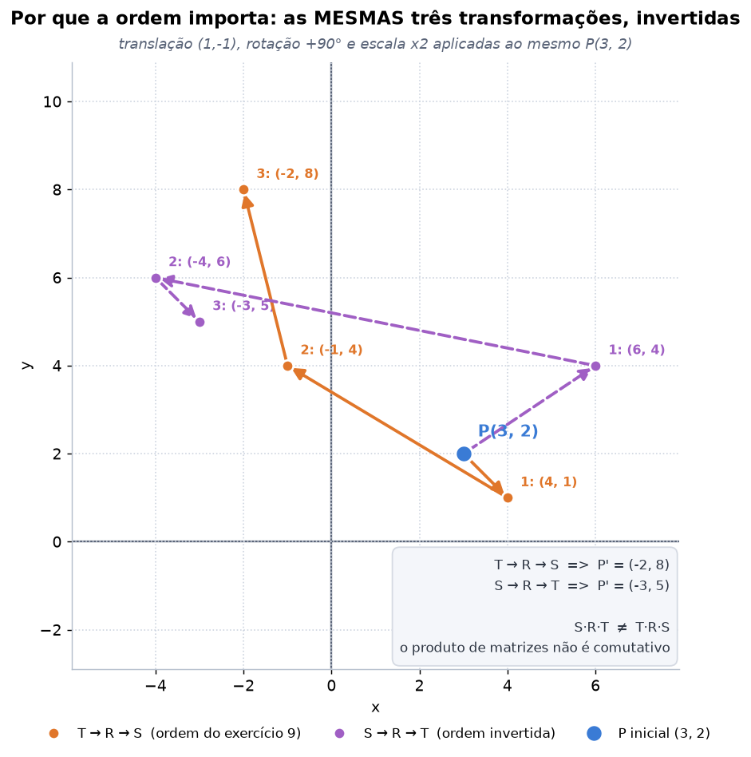

`S·R·T ≠ T·R·S` — produto de matrizes não é comutativo. É a armadilha mais comum da área, e a razão de a ordem `Model · View · Projection` ser fixa em qualquer pipeline gráfico.

O ganho prático da matriz única é de desempenho: em uma cena com milhares de vértices, o produto `S·R·T` é calculado **uma vez** e cada vértice sofre **uma** multiplicação — em vez de três passagens sobre a malha inteira.

---

### Exercício 10 — Combinação de transformações em uma figura

> Retângulo A(1,1), B(5,1), C(5,3), D(1,3): (1) translação (−2, 3); (2) escala (1,5 ; 0,5); (3) reflexão em relação ao eixo y.

```
Passo 1 — translação (-2, 3)      (-1, 4)    (3, 4)    (3, 6)     (-1, 6)
Passo 2 — escala (1,5 ; 0,5)      (-1.5, 2)  (4.5, 2)  (4.5, 3)   (-1.5, 3)
Passo 3 — reflexão no eixo y      (1.5, 2)   (-4.5, 2) (-4.5, 3)  (1.5, 3)
```

| Vértice | Original | Final |
|---|---|---|
| A | (1, 1) | **(1,5; 2)** |
| B | (5, 1) | **(−4,5; 2)** |
| C | (5, 3) | **(−4,5; 3)** |
| D | (1, 3) | **(1,5; 3)** |

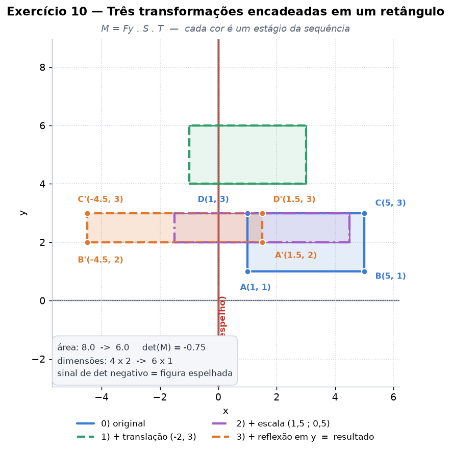

A matriz única, conferida contra o passo a passo na execução:

```
M = Fy · S · T               | -1.50   0.00   3.00 |
                       M =   |  0.00   0.50   1.50 |
                             |  0.00   0.00   1.00 |
```

Duas leituras que os números entregam de graça:

* **`det(M) = −0,75` prevê a área final sem recalculá-la.** `(−1) × 1,5 × 0,5 = −0,75`, então a área vai de 8 para `8 × 0,75 = 6` — o retângulo 4×2 virou 6×1. E o **sinal negativo** avisa que a figura foi espelhada: a área com sinal foi de +8 para −6.
* **A translação também foi escalada.** Ela foi aplicada *antes* da escala, então o `(−2, 3)` do enunciado aparece na matriz final como `(+3; +1,5)` — o `−2` foi multiplicado por 1,5 e depois refletido, e o `3` foi multiplicado por 0,5. Trocar a ordem dos passos daria outro retângulo.

---

## 5. Síntese: o que cada transformação preserva

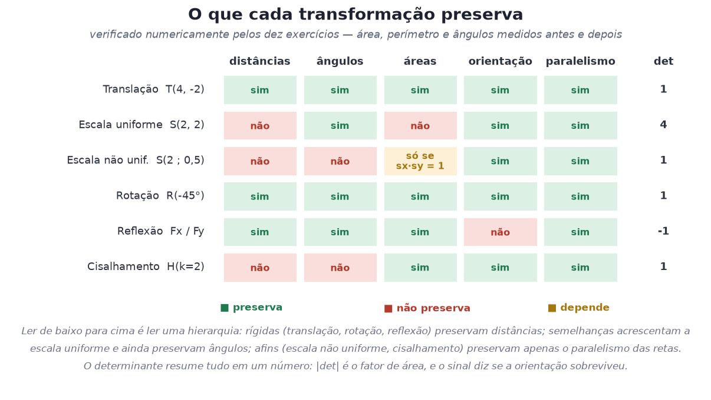

A grade não é decorativa: cada célula corresponde a uma medida apurada nos exercícios acima — área e perímetro pela fórmula do laço, ângulos internos pelo produto escalar, orientação pelo sinal da área.

Lida de cima para baixo, ela é uma **hierarquia**:

| Classe | Transformações | Preserva |
|---|---|---|
| **Rígidas** (isometrias) | translação, rotação, reflexão | distâncias, ângulos, áreas |
| **Semelhanças** | as rígidas + escala uniforme | ângulos e proporções |
| **Afins** | as anteriores + escala não uniforme, cisalhamento | apenas o paralelismo das retas |

E o **determinante resume tudo em um número**: `|det|` é o fator pelo qual qualquer área é multiplicada, e o **sinal** diz se a orientação sobreviveu. Os dez exercícios confirmam:

| Exercício | det | Efeito previsto | Efeito medido |
|---|---|---|---|
| 2 — escala ×2 | +4 | área ×4 | 3 → 12 ✓ |
| 3 — escala (2 ; 0,5) | +1 | área igual | 3 → 3 ✓ |
| 5 — rotação | +1 | área igual, orientação mantida | −9 → −9 ✓ |
| 7 — reflexão | −1 | área igual, orientação invertida | +2 → −2 ✓ |
| 8 — cisalhamento | +1 | área igual | 6 → 6 ✓ |
| 10 — composição | −0,75 | área ×0,75, espelhada | +8 → −6 ✓ |

---

## 6. Verificação algébrica

Os resultados acima só valem se as matrizes estiverem corretas. Por isso o `executar_tudo.py` testa **11 identidades** ao final da execução e interrompe tudo se qualquer uma falhar:

```
[ok] compor(S,R,T) == aplicar T, depois R, depois S
[ok] a composição NÃO comuta: S.R.T != T.R.S
[ok] T(4,-2) . T(-4,2) == identidade  (translação é invertível)
[ok] R(45°) . R(45°) == R(90°)  (rotações somam ângulos)
[ok] R(θ) é ortogonal: R . Rᵀ == identidade
[ok] Fy . Fy == identidade  (reflexão é a própria inversa)
[ok] Fx . Fy == R(180°)  (duas reflexões ortogonais = meia volta)
[ok] det(R) = +1 e det(Fx) = -1
[ok] |det(M)| prevê o fator de área de uma composição
[ok] cisalhamento preserva área: det(H) = 1
[ok] T . R . T⁻¹ gira em torno do baricentro (o centro fica parado)

11/11 verificações passaram.
```

Duas delas merecem destaque porque são resultados, não checagens de digitação:

* **`Fx · Fy = R(180°)`** — duas reflexões em eixos perpendiculares equivalem a uma rotação de meia volta. Dois determinantes −1 se multiplicam em +1, e a orientação volta ao original.
* **`T · R · T⁻¹`** — a receita para girar em torno de um ponto qualquer, que é o que o exercício 5 revelou faltar quando a figura orbitou a origem.

---

## 7. Estrutura da entrega

```
AC2/
├── AC02.md                      enunciado do estudo dirigido
├── README.md                    este documento
├── requirements.txt             numpy + matplotlib, versões da execução
├── transformacoes.py            as matrizes 3x3, composição e medidas geométricas
├── plotagem.py                  camada de desenho (estilo comum às 14 figuras)
├── exercicios.py                os dez exercícios
├── figuras_extra.py             mapa de matrizes, síntese, não-comutatividade, painel
├── executar_tudo.py             executa tudo + 11 verificações + log
└── saida/
    ├── ex01_translacao.png            ...  ex10_composicao_figura.png
    ├── mapa_matrizes.png              as seis matrizes canônicas
    ├── sintese_propriedades.png       o que cada transformação preserva
    ├── nao_comutatividade.png         a mesma sequência em ordens diferentes
    ├── painel_exercicios.png          as dez figuras em uma folha
    ├── resultados.json                coordenadas e matrizes de todos os exercícios
    └── log_execucao.txt               saída de console completa
```

A separação em quatro módulos é o que evita repetir código dez vezes: `transformacoes.py` não sabe desenhar, `plotagem.py` não sabe de transformação, e cada exercício em `exercicios.py` fica com o essencial — montar a matriz, aplicá-la e medir o resultado.

## 8. Referências

**Material da disciplina**

* `aula04/tg2d3d.pdf` — transformações geométricas 2D/3D e coordenadas homogêneas
* `aula04/Aula5.Ex1 - Transformação Geométrica (Exemplos em 2D).ipynb` — exemplos 2D com matrizes em coordenadas homogêneas (a convenção de vetor-coluna e `w = 1` seguida aqui)
* `aula05/tg3d.md` — extensão para 3D (matrizes 4×4)
* `aula08/Aula7.Ex1 - Transformações Geométricas 3D com a Biblioteca GLM.ipynb` — a mesma composição `M · V · P` usada em pipeline real

**Bibliotecas**

| Biblioteca | Uso | Repositório |
|---|---|---|
| NumPy | álgebra das matrizes 3×3 | <https://github.com/numpy/numpy> |
| Matplotlib | toda a plotagem | <https://github.com/matplotlib/matplotlib> |
