# AP1 — Relatório técnico e planejamento visual: “Ibmec em 15 segundos”

**Aluno:** Igor Rodrigues  
**Matrícula:** 202407095992  
**Curso:** Engenharia de Software  
**Software de preparação e conferência:** Blender 4.5.3 LTS  
**Arquivo:** `AP1_IgorRodrigues.blend`  
**Local modelado:** Auditório do Ibmec  
**Etapa:** concepção e modelagem inicial estática, em cinza, sem texturas.

## 1. Título e conceito geral

**“Ibmec: Da Plateia ao Palco da Vida Profissional”**

A cena representa o auditório do Ibmec como espaço de formação, apresentações e conquistas. O corredor central conduz o olhar da plateia ao palco: o aluno passa de espectador a protagonista da própria vida profissional.

A narrativa **apresentar → conquistar → atuar** é representada por exatamente três objetos autorais: **púlpito, capelo e diploma**. O púlpito representa a voz do aluno e a apresentação de ideias; o capelo simboliza a conquista acadêmica; o diploma expressa a formação concluída.

O arquivo `ap1_p.md` fornecido como roteiro permite adaptar a composição e substituir seus objetos de exemplo, mantendo três objetos autorais identificados. Esta entrega adota o auditório e os três objetos descritos no modelo do aluno. A tela e os painéis cumprem a função de enquadrar a marca que, no exemplo do professor, é exercida pelo portal. Não foram acrescentados livro, ponte ou esfera, pois isso alteraria o conceito e a contagem de três objetos.

### 1.1 Referências reais

| Plateia vista do palco | Corredor em direção ao palco |
| --- | --- |
| 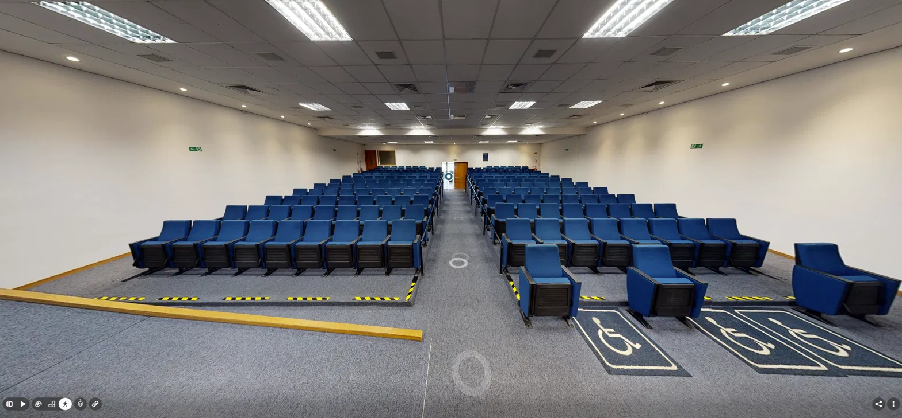 | 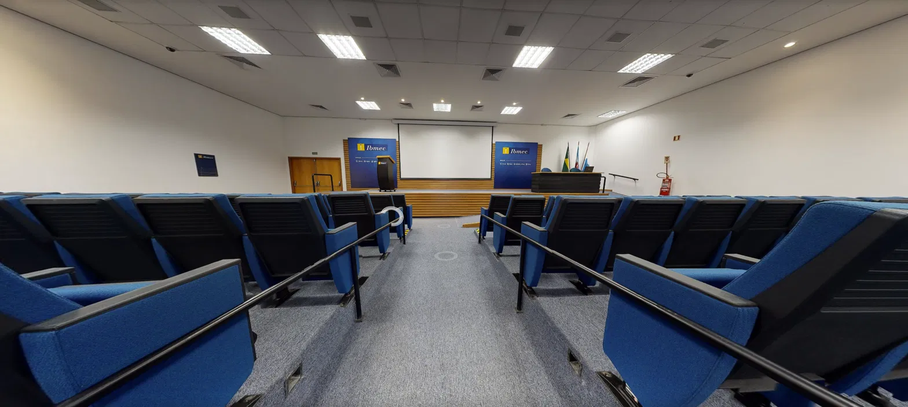 |
| Palco | Púlpito |
| 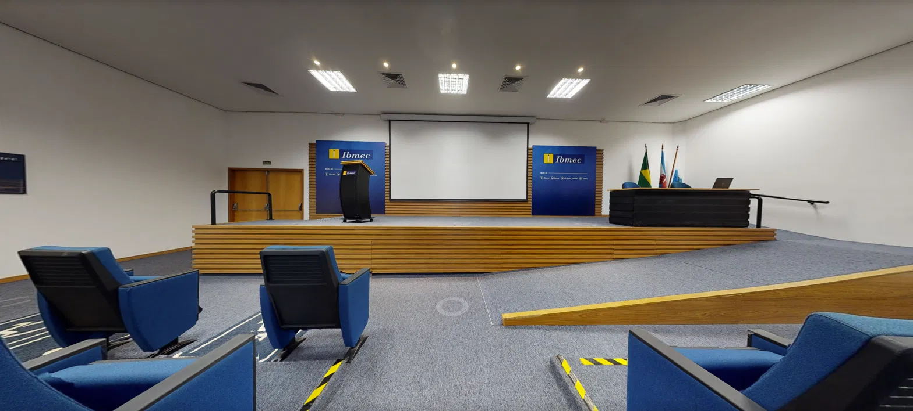 | 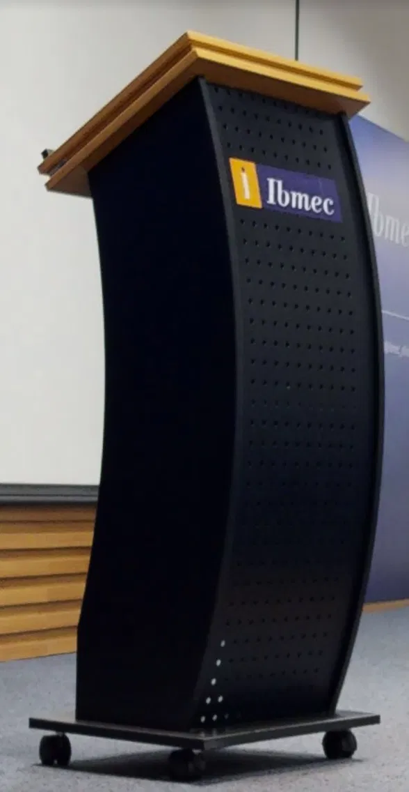 |

As fotografias orientam a disposição e as proporções dos elementos. As cores reais ficam como referência para a AP2.

### 1.2 Meta visual e estado implementado

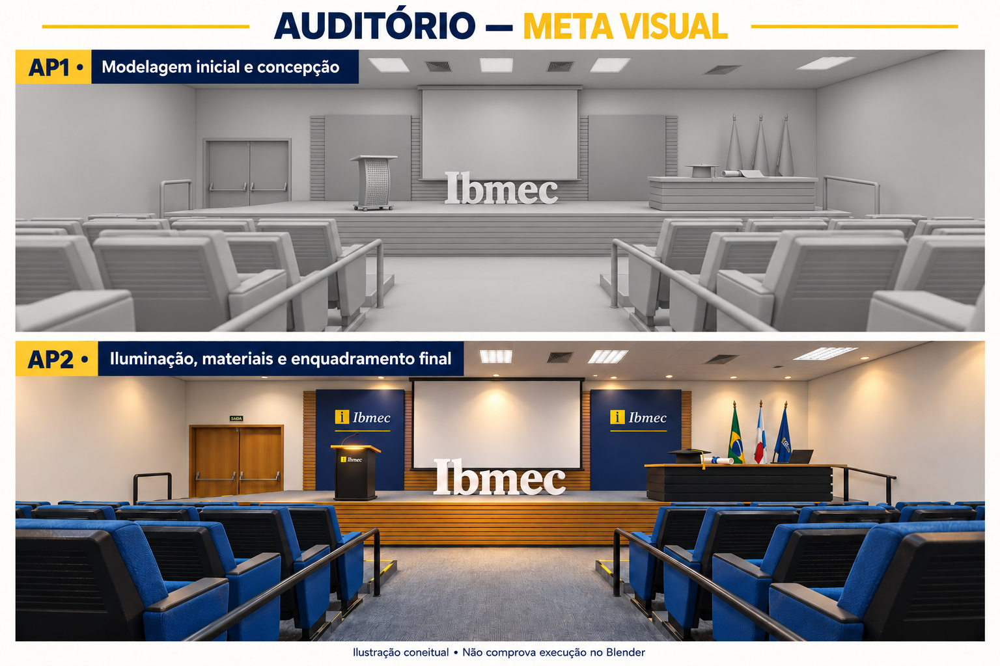

*Ilustração de planejamento: AP1 em cinza e AP2 com acabamento. Não é captura do Blender.*

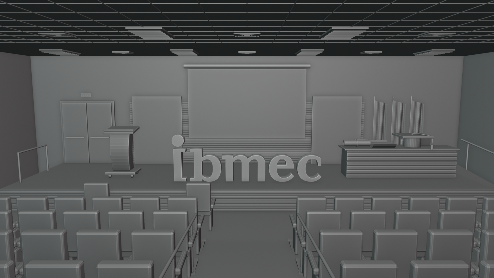

*Imagem real do arquivo entregue, gerada no Blender com Workbench, que apresenta as formas em visualização Solid/Matcap. O cenário e os três objetos estão estáticos. A geometria da marca é a do arquivo original do aluno, por isso sua grafia e seu desenho podem diferir da ilustração conceitual.*

## 2. Marca Ibmec e hierarquia visual

`Marca_Ibmec` foi incorporada do arquivo `Logo-Ibmec-3D(1).blend`, a partir do objeto original `ponto_amarelo`. Suas curvas, contornos e volume foram preservados. A marca não foi substituída por texto digitado com outra fonte.

A logo recebeu transformação uniforme para caber no palco e foi orientada para a plateia. A apresentação utiliza cinza, com a marca central e ampliada como principal elemento de leitura. Púlpito à esquerda e mesa com capelo e diploma à direita deixam a região central livre.

Na AP1, a marca já está em sua posição de apresentação, sobre o palco. Sua futura entrada por movimento, assim como a ativação da tela e das luzes, fica planejada para a AP2.

## 3. Os três objetos autorais implementados

Na coleção `Objetos_Autorais` existem **exatamente três objetos de malha**, um para cada elemento narrativo. Cada malha pode conter partes desconectadas, identificadas por grupos de vértices, sem aumentar essa contagem.

| Objeto no Outliner | Função | Implementação inicial da AP1 |
| --- | --- | --- |
| `Objeto_A_Pulpito_Pitch` | Apresentar ideias: a voz do aluno. | Corpo curvo segmentado, tampo inclinado, borda de apoio, base e quatro rodízios. Arestas com modificador Bevel. |
| `Objeto_B_Capelo_Formatura` | Conquistar: a formatura. | Copa cilíndrica, placa quadrada com espessura, botão, cordão e borla. Partes reunidas em uma malha, com Bevel discreto. |
| `Objeto_C_Diploma_Ibmec` | Atuar: formação concluída. | Folha subdividida com bordas curvas e espessura, canudo oco e fita simplificada. Partes reunidas em uma malha. |

### 3.1 Púlpito

O púlpito foi simplificado para privilegiar a silhueta curva da referência. A malha-base tem 204 vértices antes da avaliação do Bevel. As divisões horizontais do corpo permitem editar a curva; tampo, borda, base e rodízios permanecem identificáveis.

As perfurações decorativas do púlpito real não foram reproduzidas nesta etapa inicial. O objetivo da AP1 é a leitura da forma e de sua função na composição.

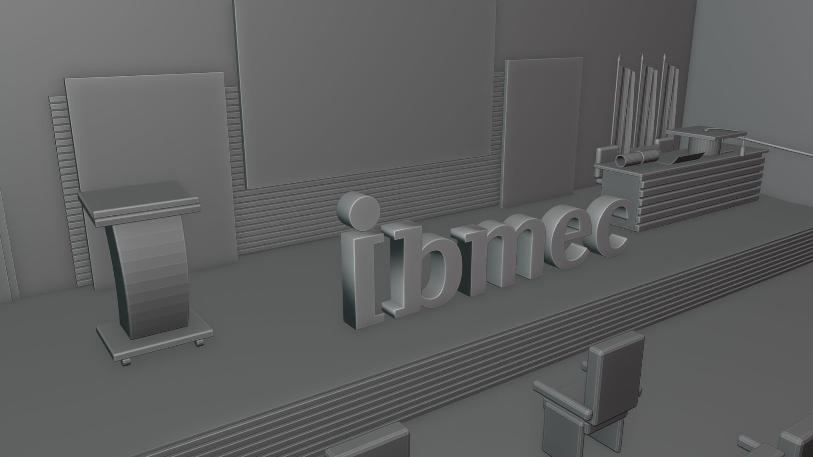

### 3.2 Capelo

O capelo está apoiado na mesa diretora, com placa quadrada, copa, botão e borla reconhecíveis. A malha-base tem 336 vértices antes do Bevel. O cordão foi construído com uma curva com espessura e convertido em malha para integrar o conjunto.

A escala foi ampliada de forma controlada para favorecer sua leitura no plano principal. O lançamento e o pouso permanecem como objetivo da AP2, sem keyframes na entrega atual.

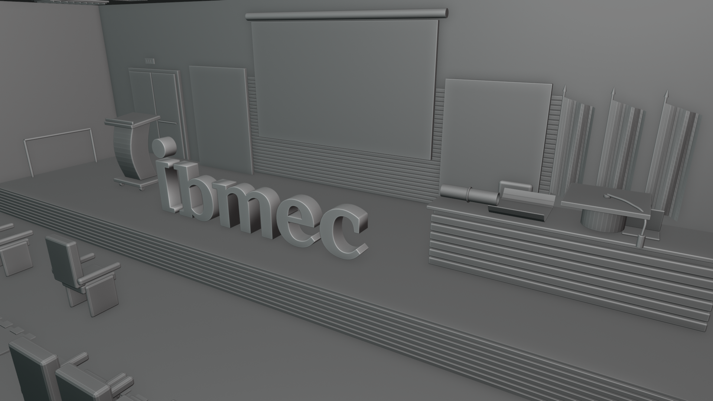

### 3.3 Diploma

O conjunto contém uma folha parcialmente curvada, um canudo oco e uma fita simples. A malha-base tem 814 vértices. A espessura da folha e do tubo foi construída com Solidify e incorporada à geometria antes da união das partes.

Os grupos de vértices `Folha_Diploma`, `Canudo` e `Fita` ajudam a identificar e separar as partes para o desenvolvimento posterior. Não há texto de certificado, assinaturas ou materiais de papel nesta etapa.

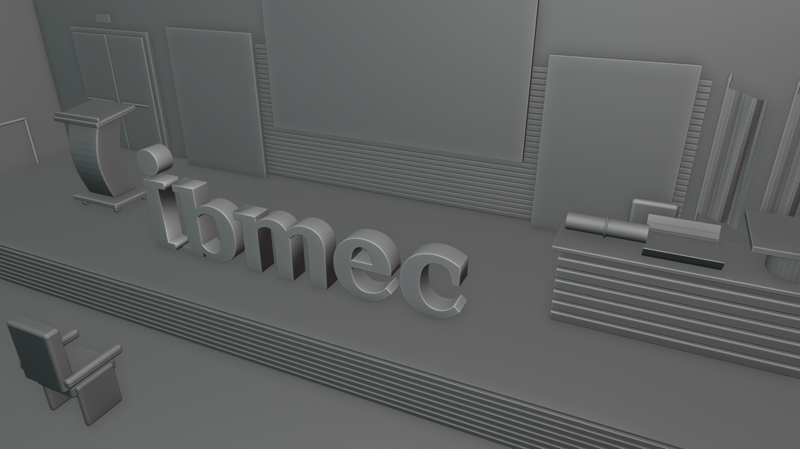

### 3.4 Guia para evolução

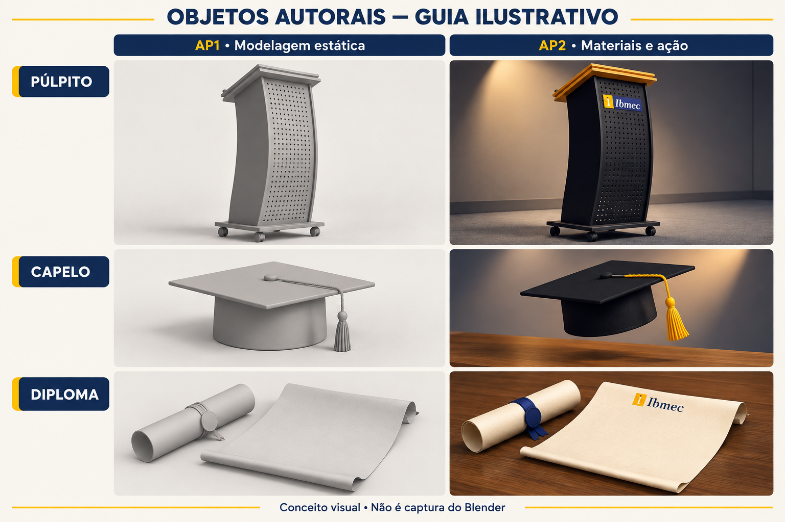

*Ilustração conceitual. As imagens das seções 3.1 a 3.3 mostram a modelagem efetiva; esta prancha orienta a evolução de acabamento.*

O auditório foi reaproveitado e simplificado a partir de `Auditorio_AP2(2).blend`. Os três objetos narrativos foram reconstruídos como malhas simples para a AP1. A logo vem do arquivo anterior fornecido pelo aluno. A implementação foi feita por script Python com a API do Blender; esta descrição registra a geometria e as operações efetivamente utilizadas, sem atribuir ações manuais de edição que não foram realizadas nesta preparação.

## 4. Técnicas e transformações geométricas

Foram utilizados recursos além da simples escala de primitivas:

- **Edição de malha segmentada:** curvatura do corpo do púlpito e da folha do diploma.
- **Bevel:** suavização controlada das arestas do púlpito e do capelo, com modificadores mantidos editáveis.
- **Curva com espessura:** construção do cordão do capelo, depois convertido para malha.
- **Solidify:** espessura da folha e do canudo, aplicada antes da união do diploma.
- **Composição de malhas:** união das partes de cada objeto autoral, preservando grupos de vértices.
- **Instâncias com malha compartilhada:** repetição das poltronas simplificadas na plateia.

| Transformação | Aplicação na cena |
| --- | --- |
| Translação | Púlpito à esquerda, mesa e objetos à direita, marca ao centro e poltronas distribuídas nas fileiras. |
| Rotação | Tampo inclinado, rodízios orientados, logo voltada para a plateia e câmeras dirigidas aos assuntos. |
| Escala | Hierarquia da marca e dimensões legíveis do capelo e do diploma. As três malhas autorais têm escala aplicada. |

A AP1 não utiliza texturas de imagem, acabamento colorido, animação de objetos ou cortes automáticos de câmera. Os materiais são cinza liso; a variação de claro e escuro permite visualizar os volumes.

## 5. Organização e configuração da cena

Coleção principal: **`AP1_Ibmec_Conceito`**.

| Subcoleção | Conteúdo |
| --- | --- |
| `Marca` | `Marca_Ibmec`, com a curva original do aluno. |
| `Objetos_Autorais` | As três malhas: púlpito, capelo e diploma. |
| `Cenario` | Arquitetura, palco, mesa, painéis, tela integrada ao painel, bandeiras, piso, corrimãos e poltronas. |
| `Camera_Luzes` | Câmera principal, câmeras de detalhe/planejamento e luzes neutras de apoio. |

**Câmera principal:** `Camera_Principal`, no corredor central, com marca e três objetos no enquadramento. As câmeras `Camera_Detalhe_Pulpito`, `Camera_Detalhe_Capelo` e `Camera_Detalhe_Diploma` permitem conferir os objetos junto da marca. Duas câmeras adicionais registram vistas de planejamento.

**Tempo:** 24 fps, frame inicial 1 e final 360 — planejamento de 15 segundos. Os marcadores da linha do tempo identificam momentos futuros da AP2; não estão vinculados a cortes e não há keyframes.

**Apresentação:** vista Solid/Matcap em cinza. As imagens anexas foram geradas no Blender com Workbench em 1920 × 1080. As luzes da cena ficam como apoio para evolução posterior; o Workbench usa sua iluminação de visualização.

## 6. Plano de evolução para a AP2

Manter a organização e as formas principais da AP1. Desenvolver materiais de tecido azul nas poltronas, madeira no palco e nos tampos, metal escuro no púlpito, tecido preto no capelo com borla amarela e papel creme com fita azul no diploma.

Animar a aproximação da câmera, o foco sobre o púlpito, o lançamento e pouso do capelo, a abertura da folha e a entrada da marca. As partes da folha deverão ser isoladas pelo grupo de vértices para deformar o papel sem dobrar o canudo e a fita. A iluminação final e a exportação MP4/H.264 serão configuradas na AP2.

## PARTE 2 — STORYBOARD: PLANEJAMENTO DE 15 SEGUNDOS

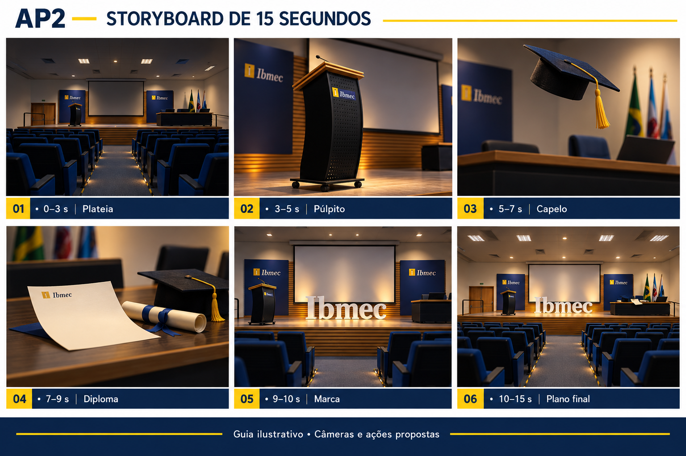

*Ilustração de intenção visual. A AP1 entregue é estática; os movimentos e cortes abaixo ainda são planejamento.*

| Momento | Frames / tempo | Ação planejada para AP2 |
| --- | --- | --- |
| **Início — a plateia** | 1–72 / 0–3 s | Aproximação pelo corredor, tela apagada e expectativa antes da apresentação. |
| **Construção — voz e conquista** | 73–240 / 3–10 s | Plano do púlpito com luz; lançamento e pouso do capelo; abertura do diploma; início da revelação da marca. |
| **Destaque — vida profissional** | 241–312 / 10–13 s | Câmera chega ao enquadramento principal, com marca dominante e objetos reconhecíveis. |
| **Encerramento** | 313–360 / 13–15 s | Composição estabilizada, marca legível e aplausos curtos previstos. |

### Quadro 1 — A plateia

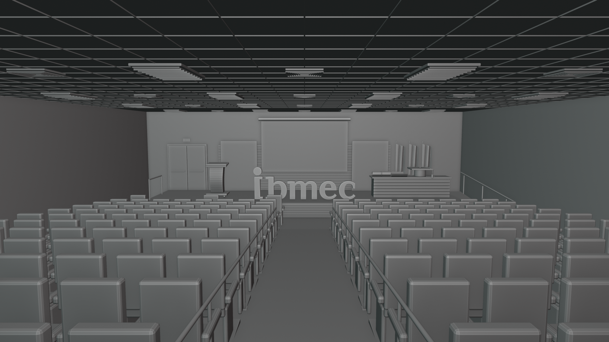

*Vista estática do arquivo AP1. Na AP2, essa posição orientará a abertura e a aproximação pelo corredor.*

### Quadro 2 — Da voz à conquista

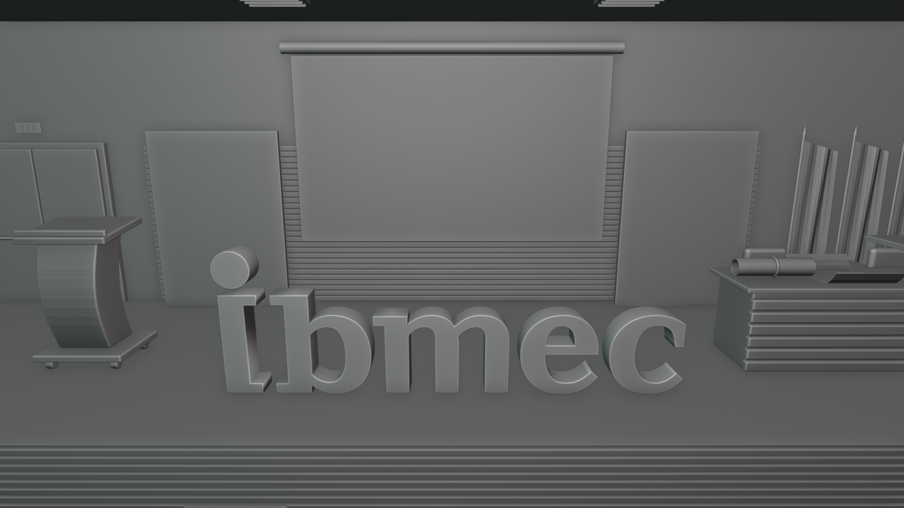

*Vista estática de estudo. Na AP2, planos de detalhe serão associados às ações do púlpito, capelo e diploma.*

### Quadro 3 — O palco da vida profissional

*Composição estática que serve de referência para a estabilização da câmera e o encerramento da AP2.*
