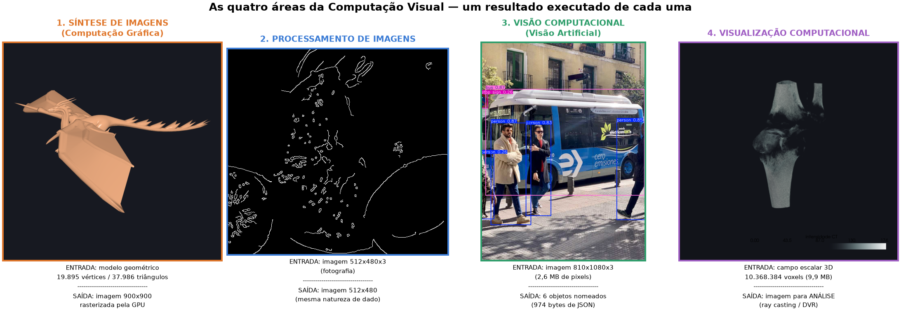
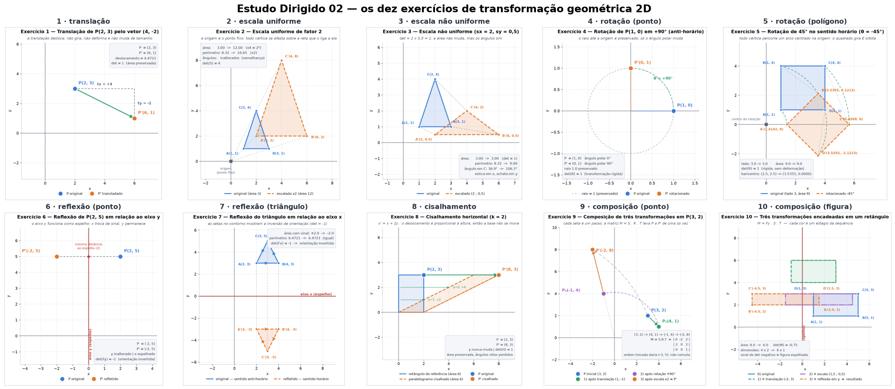
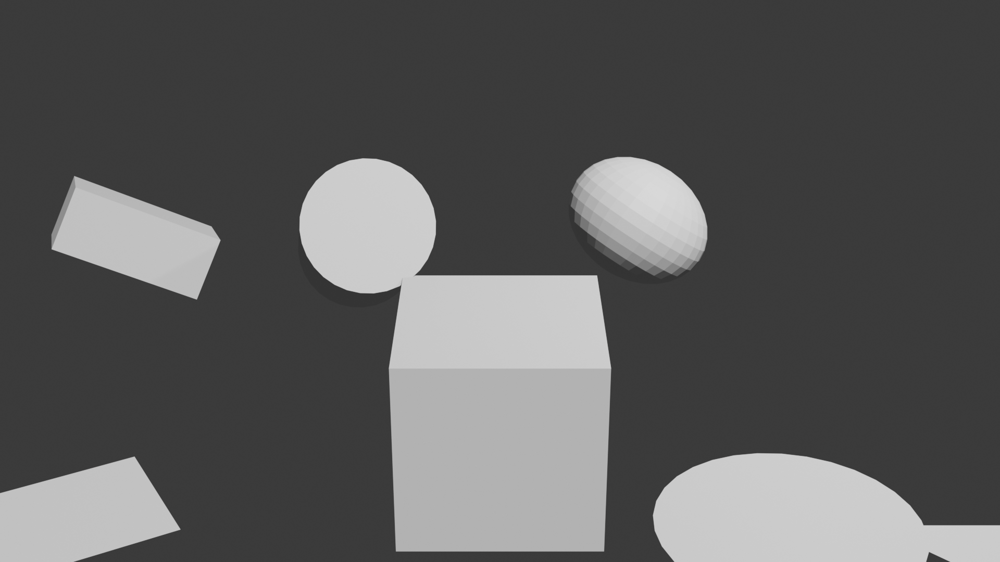
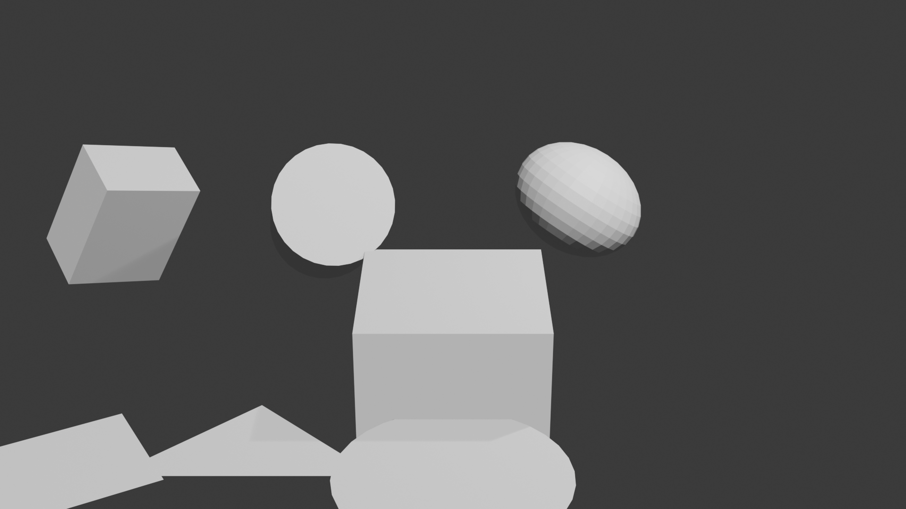

<div align="center">

# 🎨 Computação Gráfica 

### 📚 Estudos Dirigidos

**Disciplina:** Computação Gráfica &nbsp;·&nbsp; **Professor:** Jonh Edson


</div>

---

Cada pasta `ACn/` é uma **entrega autocontida**: o enunciado, o código que produz os resultados, as figuras geradas e um README próprio com a discussão completa. 📍 Este arquivo é apenas o índice.

## 🗂️ Índice das entregas

| # | 🧩 Tema | 🛠️ Ferramentas | 📊 Estado |
|:---:|---|---|:---:|
| [**AC1**](AC1/) | 🔍 As quatro áreas da Computação Visual | ModernGL · OpenCV · YOLOv8 · VTK | ✅ **concluída** |
| [**AC2**](AC2/) | 📐 Transformações geométricas 2D | NumPy · Matplotlib | ✅ **concluída** |
| [**AC3**](AC3/) | 🧊 Transformações 2D/3D no Blender | Blender 4.5 LTS · `bpy` | 🚧 **em revisão** |

```
📦 AC-Computação-Gráfica
├── 📁 AC1/    🔍 quatro áreas       → 4 programas + relatório em PDF/HTML
├── 📁 AC2/    📐 transformações 2D  → 10 exercícios + 14 figuras
├── 📁 AC3/    🧊 Blender            → cena .blend + script bpy + 2 imagens
└── 📁 docs/   📚 material da disciplina (não versionado)
```

---

## 🔍 AC1 — As quatro áreas da Computação Visual

> 🎯 **Objetivo** ([`AC1/AC01.md`](AC1/AC01.md)): demonstrar as diferenças e as principais características de Síntese de Imagens, Processamento de Imagens, Visão Computacional e Visualização Computacional — selecionando uma aplicação por área e **executando código de repositório público**, com explicação dos aspectos específicos de cada uma.



Quatro programas, um por área, todos executados de ponta a ponta (⏱️ ≈ 22 s no total). A tese que organiza a entrega é que cada área se define pelo par *(o que entra, o que sai)*:

| | 🧭 Área | 💻 Aplicação executada | ➡️ Entrada → saída, medidas na execução |
|:---:|---|---|---|
| 1️⃣ | **Síntese de Imagens** | pipeline OpenGL 3.3 Core via **ModernGL**, renderizando `dragao.obj` | 19.895 vértices → imagem 900×900 em 0,9 ms |
| 2️⃣ | **Processamento de Imagens** | **OpenCV**: aquisição, realce, restauração, convolução, segmentação | imagem 512×480×3 → imagem 512×480 |
| 3️⃣ | **Visão Computacional** | **YOLOv8n** (Ultralytics), contrastado com HOG + SVM | imagem de 2,6 MB → 6 objetos em 974 bytes |
| 4️⃣ | **Visualização Computacional** | **VTK/PyVista** (cortes, isosuperfície, DVR) + Gapminder no **Matplotlib** | 10,4 M voxels e 142 linhas → imagem para análise |

📄 Entrega em [`AC1/README.md`](AC1/README.md), com o mesmo conteúdo também em [`relatorio.pdf`](AC1/relatorio/relatorio.pdf) (26 páginas) e [`relatorio.html`](AC1/relatorio/relatorio.html). Todos os números vêm de [`relatorio/log_execucao.txt`](AC1/relatorio/log_execucao.txt).

<details>
<summary><b>📖 Referências da AC1</b></summary>

<br>

* **Material:** `aula01/intro.pdf` (sub-áreas da CG) · `aula02/intro_computacao_visual.pdf` (definição das quatro áreas, slides 15, 23, 28, 47, 50 e 66) · `aula02/bibliotecas_graficas.pdf` (OpenGL moderna e o pipeline) · `files/PI.pdf` (Processamento de Imagens) · `aula08/objetos/dragao.obj` (modelo renderizado)
* **Repositórios executados:** [ModernGL](https://github.com/moderngl/moderngl) · [OpenCV](https://github.com/opencv/opencv) · [Ultralytics YOLO](https://github.com/ultralytics/ultralytics) e [assets](https://github.com/ultralytics/assets) · [VTK](https://github.com/Kitware/VTK) · [PyVista](https://github.com/pyvista/pyvista) e [vtk-data](https://github.com/pyvista/vtk-data) · [Matplotlib](https://github.com/matplotlib/matplotlib) · [plotly/datasets](https://github.com/plotly/datasets)
* **Algoritmos:** Phong (1975) · Otsu (1979) · Canny (1986) · Marching cubes, Lorensen & Cline (1987) · HOG, Dalal & Triggs (2005) · YOLO, Redmon et al. (2016)

A lista completa está na [seção 9 do README da AC1](AC1/README.md#9-referências).

</details>

---

## 📐 AC2 — Transformações geométricas 2D

> 🎯 **Objetivo** ([`AC2/AC02.md`](AC2/AC02.md)): resolver e **plotar com Matplotlib** dez exercícios de transformação no plano — translação, escala uniforme e não uniforme, rotação, reflexão, cisalhamento e duas composições.



Os dez exercícios foram resolvidos, plotados (🖼️ 14 figuras) e verificados numericamente. A decisão de projeto que organiza a entrega é usar **coordenadas homogêneas 3×3** mesmo num problema plano: a translação não é linear, e só assim as cinco famílias viram o mesmo tipo de objeto e qualquer sequência colapsa em uma matriz só.

Além das respostas, a entrega mede o que cada transformação preserva (área, perímetro, ângulos, orientação) e fecha com **11 verificações algébricas** ✔️ que o `executar_tudo.py` roda ao final — entre elas `Fx · Fy = R(180°)`, a não-comutatividade de `S·R·T`, e `T · R · T⁻¹` como receita para girar em torno de um ponto qualquer.

> [!IMPORTANT]
> A execução **falha** se alguma das 11 verificações não passar.

📄 Entrega em [`AC2/README.md`](AC2/README.md); coordenadas e matrizes em [`saida/resultados.json`](AC2/saida/resultados.json).

<details>
<summary><b>📖 Referências da AC2</b></summary>

<br>

* **Material:** `aula04/tg2d3d.pdf` (transformações 2D/3D e coordenadas homogêneas) · `aula04/Aula5.Ex1 - Transformação Geométrica (Exemplos em 2D).ipynb` (convenção de vetor-coluna com `w = 1`, seguida aqui) · `aula05/tg3d.md` (extensão para matrizes 4×4) · `aula08/Aula7.Ex1 - Transformações Geométricas 3D com a Biblioteca GLM.ipynb` (a mesma composição `M · V · P` em pipeline real)
* **Bibliotecas:** [NumPy](https://github.com/numpy/numpy) (álgebra das matrizes) · [Matplotlib](https://github.com/matplotlib/matplotlib) (plotagem pedida no enunciado)

</details>

---

## 🧊 AC3 — Transformações 2D e 3D no Blender 4.5 LTS

> 🎯 **Objetivo** ([`AC3/AC03.md`](AC3/AC03.md)): montar a mini-cena *"Parque Geométrico"* com objetos 2D (quadrado, triângulo, círculo) e 3D (cubo, cilindro, esfera UV), aplicando translação, rotação e escala pela interface **e** por script Python; distinguir espaço local e global; animar 3 a 6 segundos com keyframes.

| Frame 1 | Frame 120 |
|---|---|
|  |  |

A cena reúne seis objetos na coleção `AC03_transformacoes` — três planos no XY e três sólidos — e tudo é construído por script: criação, transformações, hierarquia, keyframes, câmera e luz. Comparando os dois frames, o círculo transladou em X e girou 180° em Z, o cubo mudou de escala e orientação em eixos diferentes, e o triângulo acompanhou o círculo por ser seu **filho** (bônus de transformação composta, junto com o easing `EASE_IN_OUT` e o keyframe intermediário no frame 60).

📦 **Entregáveis:**

| | Item | Arquivo |
|:---:|---|---|
| 🟠 | arquivo `.blend` | [`AC03_IgorMariano.blend`](AC3/AC03_IgorMariano.blend) |
| 🐍 | script Python | [`AC03_IgorMariano.py`](AC3/AC03_IgorMariano.py) |
| 🖼️ | renders da cena (1920×1080) | [`cena_inicial.png`](AC3/AC03_IgorMariano_cena_inicial.png) · [`cena_final.png`](AC3/AC03_IgorMariano_cena_final.png) |
| 📝 | texto de entrega | [`AC03_Relatorio.md`](AC3/AC03_Relatorio.md) |
| ❓ | cinco questões teóricas | [`AC03_Questoes_Teoricas.md`](AC3/AC03_Questoes_Teoricas.md) |

As imagens são renders de câmera (`F12`) em 1920×1080, com sombras projetadas pela luz *sun* — o entregável de imagem renderizada está atendido.

<details>
<summary><b>📖 Referências da AC3</b></summary>

<br>

* **Material:** `aula04/tg2d3d.pdf` e `aula05/tg3d.md` (a teoria das transformações que a atividade exercita na prática) · `aula04/Aula5.Ex3–Ex6` (cubo, pirâmide, cilindro e esfera em transformações 3D) · `blender/blender.md` e `blender/modelagem.md` · `blender/scripts/02_cube_transform.py`, `05_rotation_scale_animation.py`, `08_parenting_hierarchy.py` e `09_render_sequence.py` (base direta da automação, da animação, da hierarquia e do render)
* **Externas:** [Blender Python API (`bpy`)](https://docs.blender.org/api/current/) · [Blender Manual](https://docs.blender.org/manual/en/latest/)
* **Nesta pasta:** [`AC03_Relatorio.md`](AC3/AC03_Relatorio.md) (texto de entrega, com as duas imagens lado a lado) · [`AC03_Questoes_Teoricas.md`](AC3/AC03_Questoes_Teoricas.md) (as cinco questões)

</details>

---

## 🚀 Como executar

Cada atividade traz o seu próprio `requirements.txt` com as versões exatas usadas na execução registrada (🐍 Python 3.12 · 🪟 Windows 11):

```bash
# 1️⃣ ambiente virtual
python -m venv .venv
.venv\Scripts\activate                 # Windows

# 2️⃣ dependências da atividade
pip install -r AC1/requirements.txt    # ou AC2/requirements.txt

# 3️⃣ execução
python AC1/executar_tudo.py
python AC2/executar_tudo.py
```

A **AC3 não usa esse ambiente**: ela roda no Python embutido do Blender 4.5 LTS. Abra o `.blend`, vá na aba *Scripting*, carregue [`AC3/AC03_IgorMariano.py`](AC3/AC03_IgorMariano.py) e execute com `Alt+P` — o script limpa a coleção `AC03_transformacoes` antes de recriá-la, então pode ser reexecutado sem duplicar objetos.

<div align="center">

---

🎓 **Computação Gráfica I** &nbsp;·&nbsp; ✅ AC1 &nbsp;·&nbsp; ✅ AC2 &nbsp;·&nbsp; 🚧 AC3

</div>
